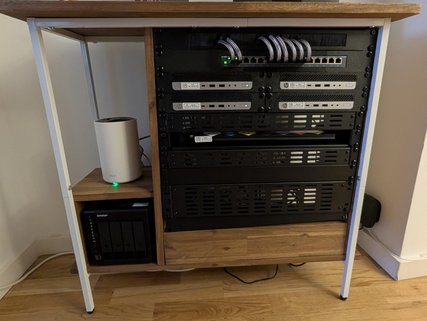

<h1 align="center">homelab</h1>

 
  <!-- K8S version -->
  
  <!-- Talos version -->
  
  <!-- OSSF Score Card -->
  
  <!-- Gondor Health -->
  
  <!-- Gondor uptime -->
  
  <!-- Gondor Response Time -->
  
  <!-- Helm Chart Release -->
  
  <!-- CodeQL Advanced -->
  

  <strong>Middle-Earth Cluster homelab repository</strong>

  A place for experimentation, fun and neverending YAML files.

   
    “Even the smallest server can run the mightiest workloads.”
    — 🧙‍♂️ Gandalf, the homelabber wizard
  

  Built with <i>viele</i> ☕️ by
  <a href="https://josimar-silva.com">Josimar Silva</a>.
   | 
  Deliverying greatness from the trenches of
  <a href="https://hello.from-gondor.com">
    Gondor.
  </a>

## Table of Contents

- [Introduction](#introduction)
- [Middle Earth Cluster](#middle-earth-cluster)
- [Software](#software)
- [Network](#network)
- [Storage](#storage)
- [Acknowledgements](#acknowledgements)
- [References](#references)

## Introduction

This repository contains the entire configuration of my Kubernetes-based homelab. 
It is managed using GitOps principles with FluxCD, Renovate and GitHub Actions. 
The goal of this project is to create a stable, reproducible and automated homelab environment for learning and experimentation.

## Middle Earth Cluster

The heart of the homelab is a Kubernetes cluster named "Middle-Earth". 
This cluster is built on top of Talos OS and its Talos configuration is provisioned from a private repository.

### Server Rack

The server rack is a custom-built 19" rack that houses all the hardware for the homelab. 
It includes the mini-PCs, switch, firewall, patch panel, NAS and UPS.

### Nodes

The k8s cluster consists of the following nodes:

| Name      | Role          | Model                   | Category        | CPU              | RAM   | Storage      |
|-----------|---------------|-------------------------|-----------------|------------------|-------|--------------|
| `gandalf` | Control Plane | EliteDesk 800 G3 Mini   | hobbit-md-i5    | Intel i5-7500t   | 16GB  | 256GB NVMe   |
| `sam`     | Worker        | EliteDesk 800 G3 Mini   | hobbit-md-i5    | Intel i5-7500t   | 16GB  | 256GB NVMe   |
| `pipin`   | Worker        | EliteDesk 800 G3 Mini   | hobbit-sm-i3    | Intel i3-6100T   | 16GB  | 120GB NVMe   |
| `merry`   | Worker        | EliteDesk 800 G3 Mini   | hobbit-sm-i3    | Intel i3-6100T   | 16GB  | 120GB NVMe   |
| `gollum`  | Worker        | Lenovo G400s Laptop     | hobbit-bg-i7    | Intel i7-3612QM  | 16GB  | 1TB Sata SSD |

## Software

The cluster runs a variety of software, from infrastructure components to user-facing applications.

### Apps

| Application                                                              | Description                                                                 |
| ------------------------------------------------------------------------ | --------------------------------------------------------------------------- |
| [`flash-slothmore`](https://service.berlin.de/)                          | A bot that crawls the Berlin Service Portal to find available appointments. |
| [`hello-from-gondor`](https://hello.from-gondor.com)                     | Simple dashboard with basic cluster metrics.                                |
| [`linkwarden`](https://docs.linkwarden.app/)                             | A self-hosted bookmark and link management system.                          |
| [`pi-hole`](https://pi-hole.net/)                                        | A network-wide ad blocker doubling as the LAN DNS server                                                  |
| [`speedtest-tracker`](https://github.com/alexjustesen/speedtest-tracker) | A tool to track internet speed over time.                                   |

### Infrastructure

| Component                                                                                        | Description                                       |
| ------------------------------------------------------------------------------------------------ | ------------------------------------------------- |
| [`cert-manager`](https://cert-manager.io/docs/)                                                  | Manages TLS certificates for the cluster.         |
| [`cloudnative-pg`](https://cloudnative-pg.io/)                                                   | Manages PostgreSQL clusters in Kubernetes.        |
| [`ingress-nginx`](https://kubernetes.github.io/ingress-nginx/)                                   | Ingress controller for external access.           |
| [`internal-dns`](https://github.com/kubernetes-sigs/external-dns/)                                                            | An instance of external-DNS configured acting as a local DNS using PiHole as the DNS server.              |
| [`k8s-dashboard`](https://kubernetes.io/docs/tasks/access-application-cluster/web-ui-dashboard/) | Kubernetes dashboard for monitoring the cluster.  |
| [`longhorn`](https://longhorn.io/docs/)                                                          | Distributed block storage for persistent volumes. |
| [`metallb`](https://metallb.universe.tf/)                                                        | Bare-metal load balancer for Kubernetes.          |
| [`onepassword`](https://developer.1password.com/docs/connect)                                    | 1Password integration for managing secrets.       |
| [`renovate`](https://docs.renovatebot.com/)                                                      | Automated dependency updates.                     |
| [`flux-system`](https://fluxcd.io/docs/)                                                         | The GitOps operator that powers the cluster.      |
| [`gatus`](https://github.com/TwiN/gatus)                                                         | Monitoring dashboard with the status of apps.      |

#### One Chart to rule them all

This project uses a custom-made Helm chart called [`one-chart`](https://github.com/josimar-silva/homelab/pkgs/container/homelab%2Fone-chart). 
This chart is designed to be flexible and reusable, and it is used to deploy all the applications that do not have a dedicated Helm chart available.

#### PostgreSQL Cluster Chart

This project includes a custom Helm chart for deploying PostgreSQL clusters
using CloudNativePG, located at `charts/postgresql-cluster`.

## Network

The network is segmented into multiple VLANs to provide security and isolation between different types of traffic. The firewall is managed by OPNsense, which is running on a dedicated appliance.

All the nodes in the Kubernetes cluster are connected to an isolated VLAN. 

`metallb` is used to provide LoadBalancer services for the applications. 

`internal-dns` provides name resolution for the services in the LAN by propagating the name records to Pihole.

## Storage

Persistent storage is provided by `longhorn`. `longhorn` is a distributed block storage system that provides persistent volumes for stateful applications. 

For backups, a [QNAP TS-453E](https://www.qnap.com/en/product/ts-453e) NAS is used as an NFS share. Longhorn is configured to use this NFS share to back up all the persistent volumes of the cluster. 

## Secret Management

Secrets are managed using `onepassword` and the 1Password Connect Operator. The operator syncs secrets from a 1Password vault to Kubernetes secrets. This allows for a secure and centralized way to manage secrets.

## Acknowledgements

This project would not have been possible without the amazing content produced by the homelab community. I would like to express my gratitude to the following individuals for been a great source of information and inspiration:

-   [Mischa Van den Burg](https://mischavandenburg.com/) - [GitHub](https://github.com/mischavandenburg/homelab)
-   [Techno Tim](https://technotim.live/)
-   [Christian Lempa](https://www.youtube.com/@christianlempa)
-   [Dave's Garage](https://www.youtube.com/@DavesGarage)
-   [Jeff Geerling](https://www.youtube.com/@JeffGeerling)
-   [Raid Owl](https://www.youtube.com/@RaidOwl)
-   [Home Network Guy](https://www.youtube.com/@homenetworkguy)
-   [Hardware Haven](https://www.youtube.com/@HardwareHaven)

The ease with which I was able to set up this Kubernetes cluster, compared to my first NAS build over a decade ago, is a testament to the quality of the content and the collaborative spirit of the homelab community.

--------------
#### *References*
-   [Kubernetes](https://kubernetes.io/)
-   [Talos OS](https://www.talos.dev/)
-   [FluxCD](https://fluxcd.io/)
-   [Renovate](https://www.mend.io/free-developer-tools/renovate/)
-   [one-chart](https://github.com/josimar-silva/homelab/tree/main/charts/one-chart)

