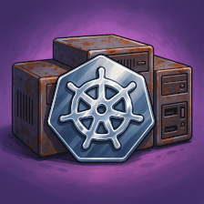

<h1 align="center">homelab</h1>

 
  <!-- K8S version -->
  
  <!-- Talos version -->
  
  <!-- Helm Chart Release -->
  

  <strong> homelab realm repository</strong>

  A place for experimentation, fun and neverending YAML files.

   
    “Even the smallest server can run the mightiest workloads.”
    — 🧙‍♂️ Gandalf, the homelabber wizard
  

  Built with <i>viele</i> ☕️ by
  <a href="https://josimar-silva.com">Josimar Silva</a>.
   | 
  Deliverying greatness from the trenches of
  <a href="https://hello.from-gondor.com">
    Gondor.
  </a>

## Table of Contents

- [Introduction](#introduction)
- [Middle Earth Cluster](#middle-earth-cluster)
- [Software](#software)
- [Network](#network)
- [Storage](#storage)
- [References](#references)

## Introduction

## Middle Earth Cluster

### Server Rack

### Nodes

## Software

### Apps

### Infrastructure

#### One Chart to rule them all

## Network

## Storage

## Secret Management

## References
