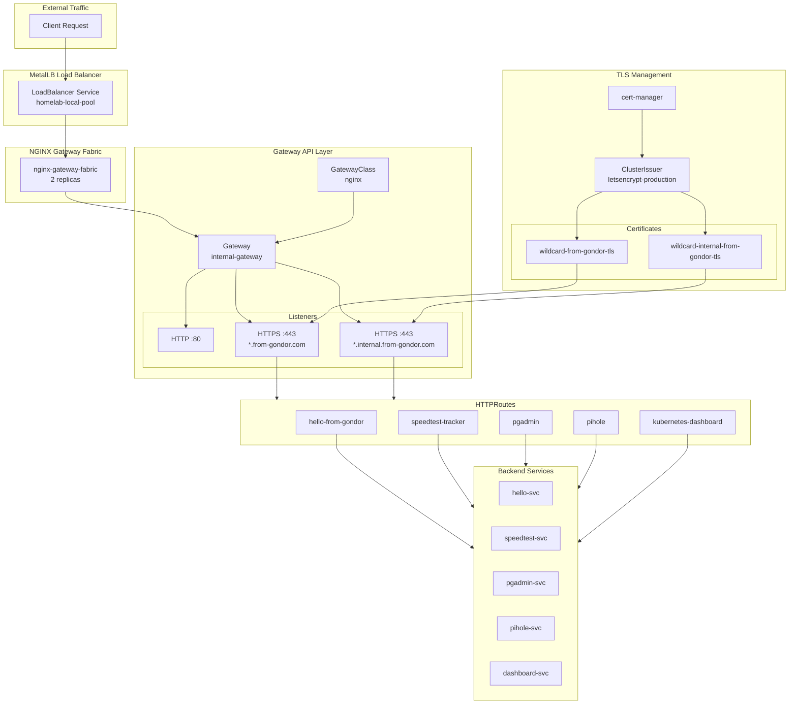
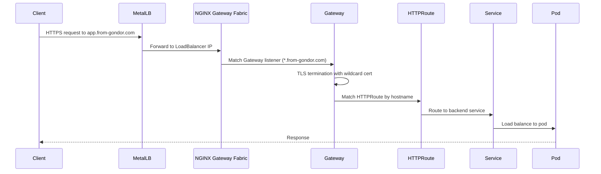
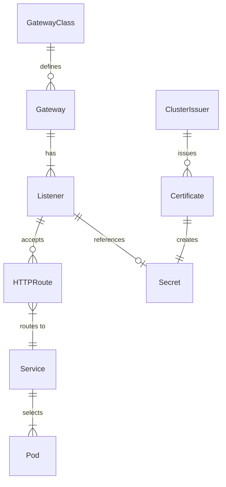

# ADR: Migration from Ingress to Gateway API

**Date:** 2025-11-24
**Status:** Accepted
**Deciders:** josimar-silva

## Context

The homelab infrastructure uses ingress-nginx for routing external traffic to services. Gateway API is the successor to Ingress, offering improved extensibility, role-oriented design, and better separation of concerns.

## Decision

Migrate from ingress-nginx to Gateway API with NGINX Gateway Fabric as the implementation.

## Architecture

### Component Overview



### Request Flow



### Resource Relationships



## File Structure

```
infrastructure/
├── base/
│   ├── gateway-api/
│   │   └── kustomization.yaml      # Gateway API CRDs (v1.4.0)
│   └── nginx-gateway-fabric/
│       ├── kustomization.yaml
│       ├── repository.yaml          # Helm repository
│       ├── release.yaml             # HelmRelease (v2.2.1)
│       ├── gateway-class.yaml       # GatewayClass: nginx
│       └── gateway.yaml             # Gateway: internal-gateway
└── configs/
    └── gateway-certificates/
        ├── kustomization.yaml
        └── certificates.yaml        # Wildcard certificates
```

## Key Differences from Ingress

| Aspect | Ingress | Gateway API |
|--------|---------|-------------|
| TLS Certificates | Annotation-driven | Explicit Certificate CRs |
| Routing | Single Ingress resource | Separate Gateway + HTTPRoute |
| Role separation | None | Infra (Gateway) vs App (HTTPRoute) |
| Extensibility | Limited | Highly extensible |
| Multi-tenancy | Difficult | Native support |

## Consequences

### Positive
- Better separation of infrastructure and application concerns
- More expressive routing capabilities
- Future-proof (Gateway API is the Kubernetes standard)
- Easier multi-team workflows

### Negative
- More resources to manage (Gateway + HTTPRoute vs single Ingress)
- Learning curve for Gateway API concepts
- Migration effort for existing services

### Neutral
- Similar performance characteristics
- Same underlying NGINX data plane

## Migration Strategy

1. **Parallel running**: Deploy Gateway API alongside existing Ingress
2. **Incremental migration**: Migrate apps one by one
3. **Validation**: Verify each app works via Gateway
4. **Cleanup**: Remove Ingress resources after full validation

## Related Documents

- [Gateway API Migration Plan](https://github.com/josimar-silva/homelab/issues/225)
- [NGINX Gateway Fabric Documentation](https://docs.nginx.com/nginx-gateway-fabric/)
