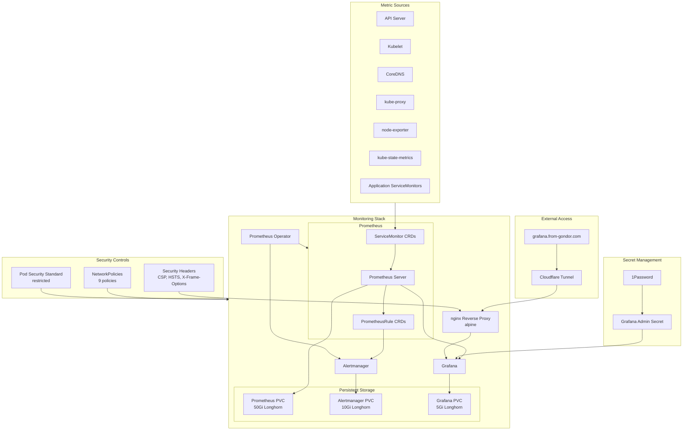
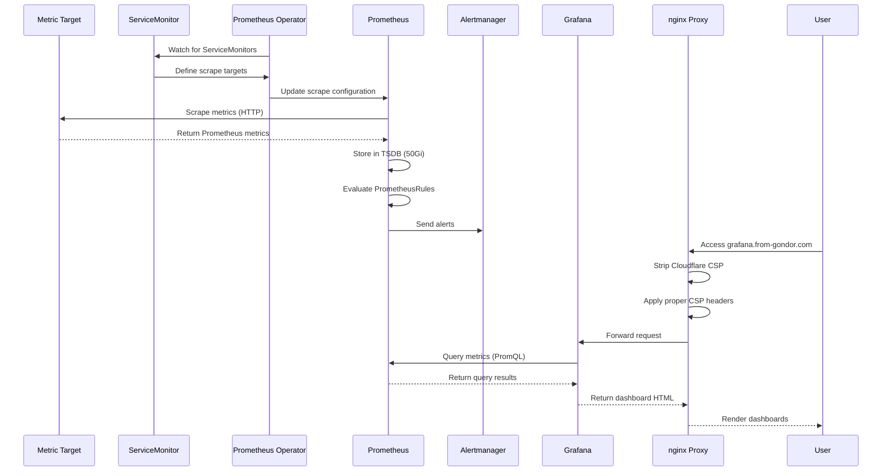
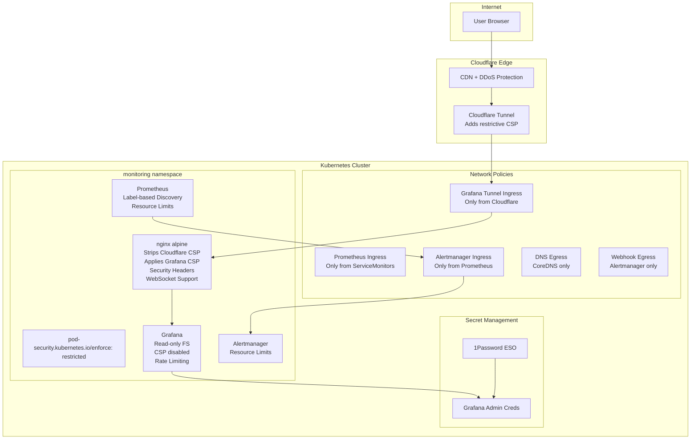

# ADR: Prometheus Stack Deployment for Kubernetes Monitoring

**Date:** 2025-11-26
**Status:** Accepted
**Deciders:** josimar-silva

## Context

A homelab Kubernetes cluster requires comprehensive monitoring and observability to:
- Track resource utilization and performance metrics
- Detect and alert on infrastructure issues
- Visualize system health and trends
- Support capacity planning and optimization
- Enable debugging and troubleshooting

The infrastructure is managed through GitOps using FluxCD, requiring a declarative approach to monitoring stack deployment. The solution must integrate with existing infrastructure components (Longhorn storage, Cloudflare tunnels, 1Password secret management) while providing enterprise-grade monitoring capabilities suitable for a production-like homelab environment.

## Decision

Deploy **kube-prometheus-stack** (Prometheus Operator) v79.8.2 via FluxCD HelmRelease, distributed through OCI registry, with security hardening and integration with existing infrastructure.

## Architecture

### Component Overview



### Monitoring Data Flow



### Security Architecture



## File Structure

```text
infrastructure/
├── base/
│   └── prometheus/
│       ├── kustomization.yaml           # Base configuration
│       ├── namespace.yaml               # monitoring namespace
│       ├── repository.yaml              # OCI Helm repository
│       ├── release.yaml                 # HelmRelease v79.8.2
│       ├── grafana-secret.yaml          # 1Password integration
│       ├── grafana-nginx-config.yaml    # nginx ConfigMap for CSP handling
│       ├── grafana-tunnel.yaml          # nginx reverse proxy + Cloudflare tunnel
│       └── networkpolicies.yaml         # Security policies
└── apps/
    └── monitoring/
        └── service-monitors/            # Application monitoring
```

## Key Decisions

### 1. Stack Selection: kube-prometheus-stack

**Decision:** Deploy kube-prometheus-stack (Prometheus Operator) instead of standalone components.

**Rationale:**
- **Industry Standard**: kube-prometheus-stack is the de facto monitoring solution for Kubernetes, with extensive community support and battle-tested in production environments
- **Integrated Components**: Bundles Prometheus, Alertmanager, Grafana, and operators in a cohesive package, reducing integration complexity
- **Operator Pattern**: Prometheus Operator provides Kubernetes-native CRDs (ServiceMonitor, PrometheusRule) enabling declarative monitoring configuration
- **Pre-configured Dashboards**: Ships with 20+ Grafana dashboards covering core Kubernetes components, reducing setup time
- **Automatic Discovery**: ServiceMonitor CRDs automatically discover and configure scrape targets based on label selectors

**Alternatives Considered:**
- **Standalone Prometheus + Grafana**: Rejected due to manual configuration overhead, no operator benefits, complex service discovery setup
- **VictoriaMetrics**: Not chosen as Prometheus meets current needs; VM would be considered for multi-cluster or higher scale
- **Cloud Provider Solutions** (GCP Monitoring, AWS CloudWatch): Not applicable for self-hosted homelab

**Trade-offs:**
- **Complexity**: Introduces operator patterns and additional CRDs to manage
- **Resource Overhead**: Operator adds ~100Mi memory, but automation benefits outweigh cost
- **Version Coupling**: Components versions are bundled; selective upgrades require values overrides

### 2. Distribution Method: OCI Registry

**Decision:** Use OCI registry (`oci://ghcr.io/prometheus-community/charts`) instead of traditional Helm repository.

**Rationale:**
- **Performance**: OCI registries leverage container image caching infrastructure, resulting in faster chart downloads (typically 2-3x faster than HTTP-based Helm repos)
- **Reliability**: Benefits from container registry redundancy and CDN distribution, reducing failure points
- **Ecosystem Alignment**: Native integration with container ecosystem tooling (registries, vulnerability scanners, artifact signing)
- **Future-Proof**: OCI is the strategic direction for Helm chart distribution (Helm 3.8+ native support)

**Alternatives Considered:**
- **Traditional Helm Repository** (`https://prometheus-community.github.io/helm-charts`): Functional but slower, HTTP-based, less cache-friendly

**Trade-offs:**
- **Tooling Support**: Some older Helm tooling may not support OCI; not an issue with FluxCD v2.0+
- **Migration Path**: Requires updating FluxCD HelmRepository resources, but one-time effort

**Implementation:**
```yaml
apiVersion: source.toolkit.fluxcd.io/v1beta2
kind: HelmRepository
metadata:
  name: prometheus-community
spec:
  type: oci
  url: oci://ghcr.io/prometheus-community/charts
```

### 3. Storage Strategy: Longhorn with Retention Policy

**Decision:** Use Longhorn storage class for all persistent volumes with specific allocations and retention periods.

**Storage Allocations:**
- **Prometheus**: 50Gi with 30-day retention
- **Alertmanager**: 10Gi
- **Grafana**: 5Gi

**Rationale:**
- **Distributed Storage**: Longhorn provides replication across nodes, protecting against single-node failures
- **Dynamic Provisioning**: Automatic PVC creation eliminates manual storage management
- **Snapshots & Backup**: Built-in snapshot capabilities enable point-in-time recovery
- **Existing Infrastructure**: Already deployed and operational in the homelab
- **Data Locality**: Keeps monitoring data within the cluster, avoiding external dependencies

**Retention Calculation:**
Prometheus 30-day retention with 50Gi storage:
- Estimated ingestion rate: ~500 samples/sec across all targets
- Approximate storage requirement: 1.5-2Gi per day
- 50Gi provides comfortable buffer for 30 days (~45Gi expected usage)

**Alternatives Considered:**
- **Local Storage**: Rejected due to lack of replication, data loss on node failure
- **NFS**: Considered but introduces external dependency, potential network bottleneck for Prometheus writes
- **Object Storage (S3/Thanos)**: Overkill for single-cluster homelab; would reconsider for multi-cluster or long-term retention (1+ year)

**Trade-offs:**
- **Cost**: Longhorn replication consumes 3x raw storage (150Gi total for 50Gi Prometheus volume with 3 replicas)
- **Performance**: Network-attached storage has higher latency than local SSD, but acceptable for homelab monitoring workload
- **Complexity**: Requires Longhorn maintenance, but already operational

### 4. Secret Management: 1Password Integration

**Decision:** Use 1Password External Secrets Operator (ESO) for Grafana admin credentials.

**Rationale:**
- **Zero Secrets in Git**: No credentials committed to repository, eliminating primary attack vector
- **Centralized Management**: Single source of truth for all infrastructure secrets
- **Rotation Support**: Credentials can be rotated in 1Password without redeploying manifests
- **Audit Trail**: 1Password provides access logging and change history
- **Integration Consistency**: Aligns with existing homelab secret management strategy

**Alternatives Considered:**
- **Sealed Secrets**: Encrypts secrets but requires key management, no centralized rotation
- **HashiCorp Vault**: Enterprise-grade but operationally heavy for homelab (requires HA setup, maintenance)

**Trade-offs:**
- **External Dependency**: Monitoring stack requires 1Password Connect API availability
- **Complexity**: Additional operator and configuration overhead
- **Recovery**: Need 1Password access to recover from disaster scenarios


### 5. External Access: Cloudflare Tunnel with nginx Reverse Proxy

**Decision:** Expose Grafana via nginx reverse proxy fronted by Cloudflare Tunnel to `grafana.from-gondor.com` instead of Ingress/Gateway API.

**Architecture:**
```
Internet → Cloudflare CDN → Cloudflare Tunnel → nginx (alpine) → Grafana
```

**Rationale:**
- **No Public IP Required**: Tunnel establishes outbound connections from cluster, eliminating need for port forwarding or public IP allocation
- **DDoS Protection**: Cloudflare edge network absorbs attacks before traffic reaches homelab
- **TLS at Edge**: Certificate management handled by Cloudflare, automatic rotation
- **Access Control**: Cloudflare Access can enforce authentication before traffic reaches Grafana
- **High Availability**: Cloudflare's global network provides 99.99% uptime SLA
- **Zero Trust**: Outbound-only connections reduce attack surface
- **CSP Header Management**: nginx reverse proxy handles Content Security Policy headers (see section 6.5)

**Alternatives Considered:**
- **Ingress + cert-manager**: Requires exposing Kubernetes cluster publicly, manual certificate management, no DDoS protection
- **Gateway API + LoadBalancer**: Similar limitations to Ingress, requires MetalLB IP, no edge security
- **NodePort**: Requires non-standard ports, manual firewall rules, no TLS automation
- **Port Forwarding**: Exposes home IP, no DDoS mitigation, fragile

**Trade-offs:**
- **Cloudflare Dependency**: Service unavailable if Cloudflare has outages
- **Latency**: Additional hop through Cloudflare edge (typically +20-50ms)
- **Additional Component**: nginx reverse proxy adds operational complexity (addressed in section 6.5)
- **Vendor Lock-in**: Tunnel configuration is Cloudflare-specific

**Metrics:**
Prometheus and Alertmanager are intentionally **not** exposed externally, accessible only within cluster via:
- Port-forwarding for operator access: `kubectl port-forward -n monitoring svc/prometheus 9090:9090`
- Internal service mesh routing for ServiceMonitors

### 6. Security Hardening: Defense-in-Depth

**Decision:** Implement comprehensive security controls across network, pod, and application layers.

#### 6.1 Network Policies (Zero Trust Segmentation)

**Implemented Policies:**
1. **prometheus-scraping**: Allow Prometheus to scrape targets cluster-wide and receive queries from Grafana/Alertmanager
2. **alertmanager-ingress**: Allow only Prometheus to reach Alertmanager (port 9093)
3. **alertmanager-egress**: Allow Alertmanager webhook notifications and DNS resolution
4. **grafana-ingress**: Allow only nginx tunnel to reach Grafana (port 3000)
5. **grafana-egress**: Allow Grafana to query Prometheus and resolve DNS
6. **operator-ingress**: Allow operator metrics scraping (port 8080)
7. **operator-egress**: Allow operator to manage resources cluster-wide
8. **tunnel-ingress**: Allow Cloudflare tunnel to reach nginx reverse proxy
9. **default-deny-all**: Deny all traffic not explicitly allowed

**Rationale:**
- **Lateral Movement Prevention**: Compromised monitoring component cannot pivot to other cluster resources
- **Blast Radius Reduction**: Limits scope of potential security incidents
- **Compliance**: Aligns with CIS Kubernetes Benchmark network segmentation requirements
- **Observability**: NetworkPolicies provide audit trail of intended traffic flows

#### 6.2 Pod Security Standards

**Decision:** Enforce `restricted` Pod Security Standard on `monitoring` namespace.

**Restrictions Applied:**
- No privileged containers
- No host namespaces (network, PID, IPC)
- No host path mounts
- Capabilities limited to minimal set
- Read-only root filesystems where possible
- Non-root user execution (UID > 1000)

**Rationale:**
- **Least Privilege**: Containers run with minimal permissions required for functionality
- **Container Breakout Prevention**: Restricted host access limits impact of container escape vulnerabilities
- **Standardization**: Enforces consistent security baseline across monitoring components

#### 6.3 Grafana Application Security

**Implemented Controls:**
- **nginx Reverse Proxy**: Manages Content Security Policy headers (see section 6.5)
- **HTTP Strict Transport Security (HSTS)**: Forces HTTPS, prevents protocol downgrade attacks (configured in nginx)
- **Security Headers**: X-Content-Type-Options, X-Frame-Options, Referrer-Policy (configured in nginx)
- **Rate Limiting**: Login rate limiting in Grafana (5 failed attempts = 15 minute lockout)
- **Session Security**: 24-hour session timeout, secure cookies, SameSite lax, token rotation
- **Read-only Filesystem**: Immutable container filesystem prevents runtime tampering
- **Disable Features**: Anonymous access disabled, user signup disabled, external snapshots disabled

**Grafana Configuration:**
```yaml
grafana.ini:
  server:
    root_url: https://grafana.from-gondor.com
    enforce_domain: true
    enable_gzip: true
  security:
    cookie_secure: true
    cookie_samesite: lax
    strict_transport_security: true
    # CSP now handled by nginx reverse proxy
    content_security_policy: false
    disable_gravatar: true
  security.login:
    max_consecutive_failed_login_attempts: 5
    failed_login_attempts_window: 300
    temporary_lockout_duration: 900
  auth.anonymous:
    enabled: false
```

**Why CSP is Disabled in Grafana:**
Grafana's built-in CSP is disabled (`content_security_policy: false`) because the nginx reverse proxy now manages CSP headers. This architectural decision is documented in section 6.5.

**Rationale:**
- **Public Exposure**: Grafana is internet-accessible, requiring hardened security posture
- **Sensitive Data**: Dashboards may reveal infrastructure topology and metrics
- **Authentication Gateway**: First line of defense before cluster access
- **Defense-in-Depth**: Multiple overlapping security controls at different layers

#### 6.4 ServiceMonitor Label Restrictions

**Decision:** Configure Prometheus to discover only ServiceMonitors with specific label selectors.

**Configuration:**
```yaml
prometheus:
  prometheusSpec:
    serviceMonitorSelector:
      matchLabels:
        prometheus: kube-prometheus-stack
```

**Rationale:**
- **Unauthorized Scraping Prevention**: Prevents rogue ServiceMonitors from causing Prometheus to scrape sensitive endpoints
- **Resource Control**: Limits scrape targets to approved services, preventing resource exhaustion
- **Multi-tenancy**: Enables future scenarios where multiple Prometheus instances coexist with isolated targets

**Trade-offs:**
- **Label Management**: Requires consistent labeling of all ServiceMonitors
- **Discoverability**: Non-labeled ServiceMonitors silently ignored, requires documentation

#### 6.5 nginx Reverse Proxy for Content Security Policy Management

**Decision:** Deploy nginx (alpine variant) as a reverse proxy between Cloudflare Tunnel and Grafana to manage Content Security Policy headers.

**Problem Statement:**
Cloudflare Tunnel was adding a restrictive Content Security Policy header (`default-src 'self'`) that blocked Grafana's inline JavaScript and CSS, breaking dashboard functionality. Grafana requires `'unsafe-inline'` and `'unsafe-eval'` in its CSP to render dashboards properly.

**Architecture:**
```
Cloudflare Tunnel (adds restrictive CSP)
    ↓
nginx Reverse Proxy (strips Cloudflare CSP, applies Grafana-compatible CSP)
    ↓
Grafana (CSP disabled internally)
```

**Implementation Details:**

**nginx Configuration** (`grafana-nginx-config.yaml`):
- **CSP Header Stripping**: `proxy_hide_header Content-Security-Policy` removes Cloudflare's CSP
- **Grafana-Compatible CSP**: Applies policy allowing `'unsafe-inline'` and `'unsafe-eval'`:
  ```
  Content-Security-Policy: default-src 'self';
    script-src 'self' 'unsafe-eval' 'unsafe-inline';
    style-src 'self' 'unsafe-inline';
    img-src 'self' data: https:;
    font-src 'self' data:;
    connect-src 'self';
    frame-ancestors 'none';
    base-uri 'self';
    form-action 'self';
  ```
- **Additional Security Headers**:
  - HSTS: `Strict-Transport-Security: max-age=31536000; includeSubDomains; preload`
  - `X-Content-Type-Options: nosniff`
  - `X-Frame-Options: DENY`
  - `Referrer-Policy: strict-origin-when-cross-origin`
- **WebSocket Support**: Enables Grafana live updates via WebSocket connections
- **Health Check**: `/health` endpoint for Kubernetes liveness/readiness probes
- **Gzip Compression**: Reduces bandwidth for dashboard assets

**nginx Security Hardening** (`grafana-tunnel.yaml`):
- **Non-root Execution**: Runs as user 101 (nginx user)
- **Read-only Root Filesystem**: Prevents runtime tampering
- **Dropped Capabilities**: All capabilities dropped (`drop: [ALL]`)
- **No Privilege Escalation**: `allowPrivilegeEscalation: false`
- **Seccomp Profile**: Uses `RuntimeDefault` seccomp profile
- **Resource Limits**: 100m CPU, 128Mi memory (limits); 50m CPU, 64Mi memory (requests)
- **Temporary Directories**: EmptyDir volumes for `/tmp` and `/var/cache/nginx` (required for read-only filesystem)

**Deployment Configuration:**
- **Image**: `nginx:<version>-alpine` (version pinned for stability and security, managed by Renovate)
- **Replicas**: 2 (high availability)
- **Service**: ClusterIP on port 80
- **ConfigMap**: `grafana-tunnel-nginx-config` contains complete nginx.conf
- **Cloudflare Tunnel Target**: `http://grafana-tunnel.monitoring.svc.cluster.local:80`
- **nginx Upstream**: `http://prometheus-grafana.monitoring.svc.cluster.local:80`

**Alternatives Considered:**
1. **Disable CSP Entirely**: Rejected due to security implications; CSP provides critical XSS protection
2. **Modify Cloudflare Settings**: Not possible; Cloudflare Tunnel enforces CSP at edge without configuration options
3. **Rewrite Grafana to Avoid Inline Scripts**: Not feasible; would require forking Grafana and maintaining custom build
4. **Use Different Tunnel Provider**: Would lose Cloudflare's DDoS protection and global CDN benefits
5. **Custom Grafana Build with External Scripts**: Rejected due to maintenance burden and complexity

**Trade-offs:**

**Positive:**
- **Functional Grafana**: Dashboards render correctly with proper CSP allowing inline scripts
- **Security Headers**: nginx provides consistent, centralized security header management
- **WebSocket Support**: Enables Grafana's live update features
- **Flexibility**: nginx configuration can be updated without redeploying Grafana
- **Defense-in-Depth**: nginx adds an additional security layer with hardened container security

**Negative:**
- **Additional Component**: Increases architectural complexity, adds another service to maintain
- **Resource Overhead**: nginx consumes ~50m CPU and 64Mi memory per replica (100m CPU, 128Mi total for 2 replicas)
- **Network Hop**: Adds ~1-2ms latency for additional proxy hop (negligible for dashboard use case)
- **Less Restrictive CSP**: Using `'unsafe-inline'` and `'unsafe-eval'` is less secure than strict CSP, but necessary for Grafana functionality
- **Operational Burden**: nginx configuration updates require ConfigMap changes and pod restarts

**Security Considerations:**
- **CSP Compromise**: The CSP policy includes `'unsafe-inline'` and `'unsafe-eval'`, which are less secure than a strict CSP. However, this is the minimum required for Grafana to function and is explicitly documented in Grafana's security guidelines.
- **XSS Risk**: While less restrictive, the CSP still provides significant XSS protection by restricting resource origins
- **Compensating Controls**: Multiple other security layers (network policies, authentication, TLS, rate limiting) provide defense-in-depth
- **Monitoring**: nginx access logs provide visibility into all requests passing through the proxy

**Why This Approach:**
This solution balances functionality with security. Cloudflare's restrictive CSP cannot be configured or disabled at the tunnel level, and Grafana fundamentally requires less restrictive CSP directives. The nginx reverse proxy provides the most maintainable solution that:
1. Preserves Cloudflare's DDoS protection and global CDN
2. Enables Grafana to function correctly
3. Centralizes security header management
4. Maintains strong container security posture
5. Provides operational flexibility for future adjustments

**Overall Security Philosophy:**
Defense-in-depth with overlapping controls ensures no single security failure compromises the monitoring stack. Each layer (network, pod, application, proxy) provides independent mitigation.

### 7. GitOps Management: FluxCD HelmRelease

**Decision:** Deploy via FluxCD HelmRelease with declarative configuration.

**Rationale:**
- **Infrastructure as Code**: All monitoring configuration versioned in Git, enabling change tracking and rollback
- **Git as Source of Truth**: Cluster state automatically reconciles with Git, preventing configuration drift
- **Automated Reconciliation**: FluxCD detects and applies changes within reconciliation interval (default 1m)
- **Consistency**: Identical deployment process across all infrastructure components
- **Audit Trail**: Git commits provide complete history of monitoring configuration changes

**HelmRelease Configuration:**
```yaml
apiVersion: helm.toolkit.fluxcd.io/v2
kind: HelmRelease
metadata:
  name: kube-prometheus-stack
  namespace: monitoring
spec:
  interval: 1h
  chart:
    spec:
      chart: kube-prometheus-stack
      version: 79.8.2
      sourceRef:
        kind: HelmRepository
        name: prometheus-community
  install:
    crds: CreateReplace
  upgrade:
    crds: CreateReplace
  values:
    # ... configuration ...
```

**Alternatives Considered:**
- **Manual Helm Install**: Rejected due to configuration drift, no rollback capability, manual reconciliation required
- **ArgoCD**: Functional alternative but introduces additional tool; FluxCD already standardized in homelab
- **Kubernetes Manifests**: Possible but loses Helm templating benefits, complex upgrade path

**Trade-offs:**
- **Learning Curve**: Requires understanding FluxCD HelmRelease CRD and reconciliation behavior
- **Debugging Complexity**: Issues may occur in multiple layers (Git, FluxCD, Helm, Kubernetes)
- **Bootstrap Dependency**: Monitoring stack requires FluxCD operational, circular dependency in bootstrapping scenario

### 8. Component Configuration: Selective Monitoring

**Decision:** Disable monitoring for control plane components not accessible in typical cluster environments; enable comprehensive data plane monitoring.

#### Disabled Components:
- **etcd**: Not exposed in managed Kubernetes or k3s default configurations
- **kube-controller-manager**: Metrics endpoint not accessible without control plane access
- **kube-scheduler**: Metrics endpoint not accessible without control plane access

#### Enabled Components:
- **kube-apiserver**: Core cluster API monitoring
- **kubelet**: Node-level container metrics (critical for resource monitoring)
- **CoreDNS**: DNS query performance and error rates
- **kube-proxy**: Network proxy metrics
- **node-exporter**: Hardware and OS metrics (CPU, memory, disk, network)
- **kube-state-metrics**: Kubernetes object state (deployments, pods, services)

**Rationale:**
- **Pragmatic Approach**: Focus monitoring on accessible and actionable components
- **Reduced Alert Noise**: Disabling inaccessible components prevents persistent scrape failures
- **Resource Efficiency**: Avoids wasted CPU/memory on failing scrape attempts
- **Coverage**: Enabled components provide comprehensive data plane observability

**Trade-offs:**
- **Incomplete Control Plane Visibility**: Cannot monitor control plane health in managed environments (acceptable for homelab)
- **Resource Overhead**: node-exporter DaemonSet runs on every node (~50Mi memory per node)

## Consequences

### Positive

1. **Comprehensive Observability**: Full visibility into cluster health, performance, and resource utilization across all layers
2. **Production-Grade Monitoring**: Enterprise-quality monitoring stack suitable for critical homelab workloads
3. **Security Hardening**: Defense-in-depth approach significantly reduces attack surface and blast radius
4. **Operational Efficiency**: Declarative GitOps management reduces manual intervention, enables self-healing
5. **Cost-Effective External Access**: Cloudflare Tunnel eliminates need for static IP or VPN while providing DDoS protection
6. **Scalability**: Prometheus Operator pattern scales seamlessly as new services are added via ServiceMonitors
7. **Integration**: Native integration with existing infrastructure (Longhorn, 1Password, FluxCD)
8. **Functional Grafana**: nginx reverse proxy resolves CSP issues, enabling full dashboard functionality
9. **Centralized Security Headers**: nginx provides consistent security header management for external access

### Negative

1. **Resource Consumption**: Full stack consumes ~3.1Gi memory and ~1.15 CPU cores under typical load
   - Prometheus: ~1Gi memory, 500m CPU
   - Grafana: ~500Mi memory, 500m CPU
   - Alertmanager: ~128Mi memory, 100m CPU
   - Prometheus Operator: ~128Mi memory, 100m CPU
   - node-exporter: ~64Mi memory per node, 50m CPU per node
   - kube-state-metrics: ~64Mi memory, 10m CPU
   - nginx reverse proxy: ~128Mi memory (2 replicas), 100m CPU
2. **Storage Costs**: 150Gi total storage (50Gi × 3 replicas) for Prometheus data, plus 30Gi for Alertmanager/Grafana (total: 180Gi)
3. **Complexity**: Multiple operators, CRDs, networking policies, and proxy layers increase system complexity
4. **External Dependencies**: Relies on Cloudflare (Grafana access) and 1Password (secrets) availability
5. **Learning Curve**: Team members must understand Prometheus PromQL, Grafana dashboards, operator patterns, and nginx configuration
6. **Additional Component Maintenance**: nginx reverse proxy requires ConfigMap management and version updates
7. **Less Restrictive CSP**: nginx CSP includes `'unsafe-inline'` and `'unsafe-eval'`, which is less secure than strict CSP but necessary for Grafana

### Neutral

1. **Maintenance Overhead**: Regular updates required for chart, operators, component versions, and nginx
2. **Backup Requirements**: Grafana dashboards and Prometheus data should be backed up (Longhorn snapshots)
3. **Alert Tuning**: Initial alert rules require tuning to reduce false positives
4. **Dashboard Customization**: Default dashboards may need customization for specific homelab use cases
5. **nginx Configuration**: Changes to security headers or CSP policy require ConfigMap updates and rolling restarts

## Implementation Details

### Deployment Process

1. **FluxCD applies HelmRepository**: Configures OCI registry connection
2. **FluxCD applies ConfigMaps**: Creates nginx configuration for reverse proxy
3. **FluxCD reconciles HelmRelease**: Downloads chart v79.8.2, renders templates with values
4. **Prometheus Operator deploys**: Creates CRDs (ServiceMonitor, PrometheusRule, Alertmanager, etc.)
5. **Core components start**: Prometheus, Alertmanager, Grafana pods created with PVCs
6. **nginx reverse proxy starts**: Two replicas with ConfigMap-mounted nginx.conf
7. **ServiceMonitors discovered**: Operator configures Prometheus scrape targets based on label selectors
8. **NetworkPolicies enforced**: Zero-trust network segmentation activated
9. **1Password ESO syncs**: Grafana admin credentials populated from 1Password vault
10. **Cloudflare Tunnel connects**: Tunnel routes to nginx, which proxies to Grafana

### Traffic Flow (External Access)

```
User Browser (HTTPS)
    ↓
Cloudflare CDN (TLS termination, DDoS protection)
    ↓
Cloudflare Tunnel (adds restrictive CSP: default-src 'self')
    ↓
nginx Reverse Proxy (HTTP, port 80)
    - Strips Cloudflare CSP headers
    - Applies Grafana-compatible CSP
    - Adds HSTS, X-Content-Type-Options, X-Frame-Options
    - Handles WebSocket upgrades
    ↓
Grafana (HTTP, port 80)
    - Serves dashboards (CSP disabled internally)
    - Queries Prometheus for metrics
    ↓
Prometheus (metrics queries)
```

### Monitoring Coverage

**Cluster-Level Metrics:**
- Node CPU, memory, disk, network utilization
- Cluster capacity and allocation rates
- Pod resource consumption and limits
- Persistent volume usage

**Application Metrics:**
- HTTP request rates and latencies (via ServiceMonitors)
- Application-specific business metrics (custom exporters)
- Job and CronJob execution status

**Networking Metrics:**
- CoreDNS query rates and error rates
- Service mesh traffic (if applicable)
- Ingress/Gateway request patterns

### Pre-configured Dashboards

kube-prometheus-stack includes 20+ Grafana dashboards:
- **Kubernetes / Compute Resources / Cluster**: Cluster-wide CPU, memory, network
- **Kubernetes / Compute Resources / Namespace**: Per-namespace resource usage
- **Kubernetes / Compute Resources / Pod**: Per-pod resource usage
- **Kubernetes / Networking / Cluster**: Network bandwidth and packet rates
- **Node Exporter / Nodes**: Hardware-level metrics (CPU, disk I/O, filesystem)
- **Prometheus / Overview**: Prometheus server health and performance

### Alert Rules

Default alert rules cover:
- **Availability**: Pod/deployment down, node not ready
- **Resource Exhaustion**: High CPU/memory, disk full
- **Kubernetes Objects**: CrashLoopBackOff, ImagePullBackOff
- **Prometheus Health**: Scrape failures, rule evaluation failures

### Upgrade Strategy

1. **Monitor Release Notes**: Review kube-prometheus-stack, component changelogs, and nginx version updates
2. **Update Chart Version**: Modify HelmRelease chart version in Git
3. **Update nginx Image**: Update nginx image tag in grafana-tunnel.yaml if needed
4. **Commit and Push**: FluxCD automatically reconciles within 1 hour
5. **Validate**: Check Prometheus, Grafana, Alertmanager, nginx pods healthy
6. **Test Queries**: Verify dashboards and alerts functional
7. **Test External Access**: Confirm Grafana accessible via grafana.from-gondor.com with proper CSP
8. **Rollback if Needed**: Git revert triggers automatic rollback

### Disaster Recovery

**Backup Strategy:**
- **Prometheus Data**: Longhorn snapshots every 6 hours, retained 7 days
- **Grafana Dashboards**: Exported as JSON, stored in Git repository
- **Alert Rules**: PrometheusRule CRDs in Git (source of truth)
- **nginx Configuration**: ConfigMap in Git (declarative, version-controlled)

**Recovery Process:**
1. FluxCD redeploys HelmRelease from Git
2. FluxCD recreates nginx ConfigMap from Git
3. Longhorn restores PVCs from snapshots
4. 1Password ESO re-syncs Grafana credentials
5. nginx reverse proxy pods restart with restored configuration
6. Cloudflare Tunnel auto-reconnects to nginx service

**RTO/RPO:**
- Recovery Time Objective (RTO): ~15 minutes (Kubernetes pod restart time)
- Recovery Point Objective (RPO): ~6 hours (snapshot interval)

## References

- [kube-prometheus-stack Chart Documentation](https://github.com/prometheus-community/helm-charts/tree/main/charts/kube-prometheus-stack)
- [Prometheus Operator Documentation](https://prometheus-operator.dev/)
- [Prometheus Best Practices](https://prometheus.io/docs/practices/naming/)
- [CIS Kubernetes Benchmark](https://www.cisecurity.org/benchmark/kubernetes)
- [Kubernetes Pod Security Standards](https://kubernetes.io/docs/concepts/security/pod-security-standards/)
- [Grafana Security Guide](https://grafana.com/docs/grafana/latest/setup-grafana/configure-security/)
- [Grafana Content Security Policy](https://grafana.com/docs/grafana/latest/setup-grafana/configure-security/configure-security-hardening/#content-security-policy)
- [FluxCD Helm Controller Documentation](https://fluxcd.io/flux/components/helm/)
- [nginx Security Hardening](https://nginx.org/en/docs/http/ngx_http_core_module.html#server)
- [Content Security Policy Level 3](https://www.w3.org/TR/CSP3/)
