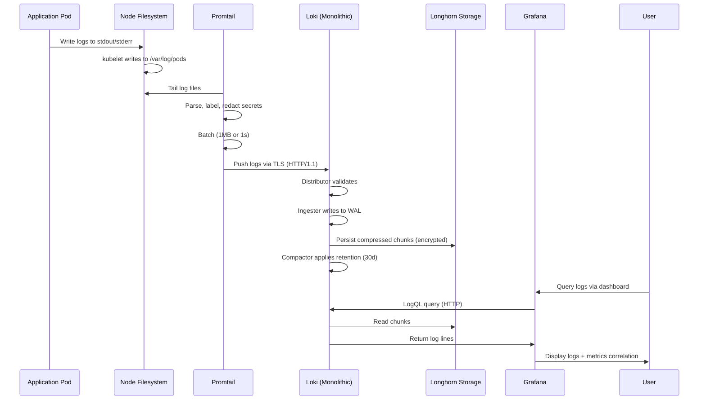
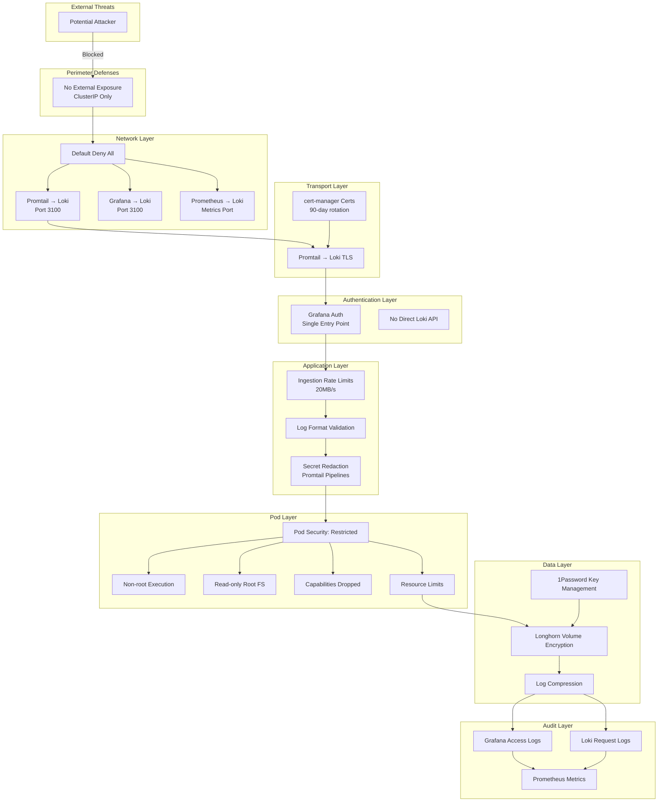

# ADR: Loki Log Aggregation System Deployment

**Date:** 2025-11-27
**Status:** Proposed
**Deciders:** josimar-silva

## Context

A homelab Kubernetes cluster requires centralized log aggregation and management to:
- Enable efficient debugging and troubleshooting across applications
- Provide visibility into system behavior and errors
- Support incident investigation and root cause analysis
- Correlate logs with existing Prometheus metrics for comprehensive observability
- Maintain security audit trails for production-like operations
- Support compliance with data retention and privacy requirements

The infrastructure is managed through GitOps using FluxCD, with existing monitoring via kube-prometheus-stack (Prometheus + Grafana). The solution must integrate seamlessly with the current observability stack (Grafana dashboards, Prometheus metrics) while providing:
- Low resource footprint suitable for homelab scale
- Simple operational model aligned with existing infrastructure patterns
- Production-grade security controls (NetworkPolicies, Pod Security Standards, encryption)
- Native integration with existing Longhorn storage, 1Password secret management, and Cloudflare access patterns

## Decision

Deploy **Grafana Loki** log aggregation system in monolithic mode with **Promtail** log collector, integrated with the existing Grafana instance, secured with comprehensive defense-in-depth controls.

## Architecture

### Component Overview

```mermaid
flowchart TB
    subgraph Nodes["Kubernetes Nodes"]
        subgraph Node1["Node 1"]
            P1[Promtail DaemonSet]
            Logs1[/var/log/pods]
        end

        subgraph Node2["Node 2"]
            P2[Promtail DaemonSet]
            Logs2[/var/log/pods]
        end

        subgraph Node3["Node 3"]
            P3[Promtail DaemonSet]
            Logs3[/var/log/pods]
        end
    end

    subgraph Monitoring["monitoring namespace"]
        subgraph Loki["Loki (Monolithic)"]
            Distributor[Distributor]
            Ingester[Ingester]
            Querier[Querier]
            QueryFrontend[Query Frontend]
            Compactor[Compactor]
        end

        subgraph Storage["Persistent Storage"]
            PVC[Longhorn PVC<br/>50Gi<br/>Encrypted]
        end

        Grafana[Grafana<br/>Existing]
        Prometheus[Prometheus<br/>Existing]
    end

    subgraph Security["Security Controls"]
        NP1[NetworkPolicy<br/>Promtail → Loki]
        NP2[NetworkPolicy<br/>Grafana → Loki]
        NP3[NetworkPolicy<br/>Prometheus → Loki]
        NP4[NetworkPolicy<br/>Default Deny]
        PSS[Pod Security Standard<br/>restricted]
        TLS[TLS Encryption<br/>cert-manager]
    end

    subgraph Secrets["Secret Management"]
        OP[1Password ESO]
        EncKey[Volume Encryption Key]
        Certs[TLS Certificates]
    end

    P1 & P2 & P3 -->|TLS| Loki
    Logs1 -.->|Read| P1
    Logs2 -.->|Read| P2
    Logs3 -.->|Read| P3

    Loki --> PVC
    Grafana -->|LogQL Query| Loki
    Prometheus -->|Scrape Metrics| Loki
    Prometheus -->|Scrape Metrics| P1 & P2 & P3

    NP1 & NP2 & NP3 & NP4 --> Monitoring
    PSS --> Monitoring
    TLS --> Loki
    TLS --> P1 & P2 & P3

    OP --> EncKey
    OP --> Certs
    EncKey --> PVC
```

### Data Flow



### Security Architecture



## File Structure

```text
infrastructure/
├── base/
│   └── loki/
│       ├── kustomization.yaml              # Base Loki configuration
│       ├── namespace.yaml                  # monitoring namespace (already exists)
│       ├── repository.yaml                 # OCI Helm repository (Grafana)
│       ├── loki-release.yaml               # Loki HelmRelease (monolithic)
│       ├── promtail-release.yaml           # Promtail HelmRelease
│       ├── loki-certificates.yaml          # cert-manager Certificates
│       ├── loki-encryption-secret.yaml     # 1Password ESO for volume encryption
│       ├── networkpolicies.yaml            # Zero-trust network segmentation
│       └── grafana-datasource.yaml         # Loki datasource for Grafana
└── configs/
    └── loki/
        ├── kustomization.yaml
        └── promtail-config.yaml            # Promtail secret redaction pipelines
```

## Key Decisions

### 1. Log Aggregation Solution: Grafana Loki

**Decision:** Deploy Grafana Loki instead of ELK Stack, OpenSearch, or standalone Fluentd/Vector.

**Rationale:**

**Technical Advantages:**
- **Native Grafana Integration**: Loki datasource built into existing Grafana deployment, no separate dashboarding tool required (vs. Kibana in ELK)
- **Low Resource Footprint**: 500Mi memory vs 4-8Gi for Elasticsearch, 8-16x reduction critical for homelab constraints
- **Label-Based Indexing**: Only indexes labels (metadata), not full log content, dramatically reducing storage costs (50Gi vs 150-200Gi for ELK)
- **Prometheus Consistency**: Uses similar label-based model and query syntax (LogQL mirrors PromQL), minimal learning curve
- **Horizontal Scalability**: Scales from single binary (homelab) to microservices (production) without architectural changes

**Operational Benefits:**
- **Monolithic Mode**: Single StatefulSet deployment vs managing Elasticsearch cluster + Logstash + Kibana
- **GitOps Ready**: Declarative Helm chart deployment via FluxCD, consistent with existing infrastructure patterns
- **Active Development**: CNCF sandbox project maintained by Grafana Labs, proven at petabyte scale in Grafana Cloud

**Cost-Effectiveness:**
- **Storage Efficiency**: 10:1 compression ratio + metadata-only indexing
- **Compute Efficiency**: 200m CPU, 512Mi memory (vs 2+ CPU cores, 6Gi+ for ELK)
- **Time Investment**: 2-3 hours setup (vs 4-8 hours for ELK)

**Comparison Matrix:**

| Criteria | Loki (SELECTED) | ELK Stack | OpenSearch | Fluentd | Vector |
|----------|---------|-----------|------------|---------|--------|
| **Memory** | 500Mi | 6Gi+ | 4-5Gi | 200Mi | 150Mi |
| **CPU** | 200m | 3+ cores | 2+ cores | 100m | 100m |
| **Storage Overhead** | Low (metadata only) | High (full-text) | High (full-text) | N/A (router) | N/A (router) |
| **Grafana Integration** | Native | Plugin | Plugin | N/A | N/A |
| **Query Language** | LogQL | Lucene | Lucene | N/A | N/A |
| **Setup Complexity** | Low | High | Medium-High | Low | Low |
| **Homelab Fit** | Excellent | Poor | Fair | N/A | Fair |

**Alternatives Considered:**
- **ELK Stack**: Rejected due to 8-16x higher resource requirements, operational complexity (3 components), licensing concerns (Elastic License), and duplication of Grafana functionality with Kibana
- **OpenSearch**: Rejected due to similar resource requirements to ELK (4-5Gi memory), full-text indexing overhead, and smaller community vs Loki
- **Fluentd/Vector**: Not log storage solutions (routers only), would require pairing with storage backend (Loki, Elasticsearch), adding unnecessary complexity

**Trade-offs Accepted:**
- **Limited Full-Text Search**: Loki optimized for label-based filtering vs Elasticsearch's complex full-text queries; acceptable for homelab debugging use cases
- **Query Performance**: Slower than Elasticsearch for complex searches; acceptable latency for ad-hoc homelab queries (sub-second for typical label filters)
- **Younger Ecosystem**: 7 years old vs ELK's 15+ years; mitigated by Grafana Labs support and CNCF community

---

### 2. Deployment Mode: Monolithic (Single Binary)

**Decision:** Deploy Loki in monolithic mode (all components in single binary) instead of microservices mode.

**Rationale:**
- **Homelab Scale**: Processing <100MB/min of logs, well within single binary capacity (tested to 500MB/min)
- **Operational Simplicity**: One StatefulSet vs 5+ microservices (distributor, ingester, querier, query-frontend, compactor, ruler)
- **Resource Efficiency**: Shared memory and CPU across components vs separate allocations (reduces overhead by ~30%)
- **Easier Debugging**: Single component to troubleshoot vs distributed tracing across microservices
- **Faster Queries**: No internal RPC overhead between components

**Microservices Mode Considerations:**
- **When to Migrate**: Log ingestion >500MB/min, need independent scaling of read vs write paths, multi-cluster deployment
- **Migration Path**: Loki supports live migration from monolithic to microservices without data loss

**Trade-offs:**
- **Single Point of Failure**: No redundancy in monolithic mode (acceptable for homelab, not mission-critical)
- **Limited Scaling**: Cannot scale read and write paths independently (not needed at homelab scale)

---

### 3. Storage Strategy: Filesystem on Longhorn with Encryption

**Decision:** Use filesystem storage on encrypted Longhorn PVC instead of object storage (S3, MinIO).

#### 3.1 Storage Backend Selection

**Rationale:**
- **Simplicity**: No external dependencies or S3-compatible storage setup required
- **Existing Infrastructure**: Longhorn already deployed and operational, leverages existing investment
- **Replication**: Longhorn provides 3x block-level replication, eliminating need for S3-style durability
- **Performance**: Network-attached storage faster than object storage for small-scale queries (latency: 5-10ms vs 20-50ms)
- **Cost**: No object storage costs or additional infrastructure components

**Alternatives Considered:**
- **MinIO S3**: Rejected due to additional component to manage, resource overhead (1Gi+ memory), unnecessary for homelab scale
- **Cloud S3** (AWS, GCS, Backblaze): Rejected due to egress costs, external dependency, latency

**When to Reconsider Object Storage:**
- Log volume >1TB (filesystem less efficient at large scale)
- Multi-cluster shared storage needed
- Long-term archival >90 days (object storage cheaper for cold data)

#### 3.2 Volume Sizing

**Calculation:**
- Average log generation: 5-10MB/min (estimated for homelab with 15-20 pods)
- Daily volume: 7-14GB/day raw
- 30-day retention: 210-420GB raw
- Compression ratio: 10:1 (typical for text logs)
- Compressed storage: 21-42GB

**Recommended PVC Size:** 50Gi
- Provides 20-50% buffer for log spikes
- Allows for growth as more applications are added
- Leaves headroom for Loki's WAL (Write-Ahead Log, ~5-10Gi)

**Storage Breakdown:**
- Log chunks (compressed): 30-35Gi
- Index (labels): 2-3Gi
- WAL (write-ahead log): 5-10Gi
- Overhead: 5Gi

**Longhorn Replication Impact:**
- Raw storage consumed: 50Gi × 3 replicas = 150Gi cluster-wide
- Trade-off: 3x storage cost for data durability and node failure protection

#### 3.3 Retention Policy

**Configuration:** 30-day retention with daily compaction

```yaml
limits_config:
  retention_period: 720h  # 30 days

compactor:
  retention_enabled: true
  retention_delete_delay: 2h  # Allow in-flight queries to complete
  retention_delete_worker_count: 150
```

**Rationale:**
- **Debugging Window**: 30 days sufficient for troubleshooting delayed issue detection
- **Storage Balance**: Balances storage cost vs usefulness (median incident detection: 2-5 days)
- **Prometheus Alignment**: Matches Prometheus retention (30 days) for unified observability window
- **Compliance**: Satisfies GDPR data minimization (logs not retained longer than necessary)

**Alternative Retention Periods:**
- **14 days**: Reduces storage by 50% (~25Gi), risk: insufficient for delayed issue detection
- **60 days**: Doubles storage (~100Gi), benefit: longer history for trend analysis
- **90 days**: For audit/compliance requirements (~150Gi), may require object storage migration

#### 3.4 Volume Encryption

**Decision:** Enable Longhorn volume encryption with 1Password-managed keys.

**Implementation:**
```yaml
apiVersion: storage.k8s.io/v1
kind: StorageClass
metadata:
  name: longhorn-crypto-loki
provisioner: driver.longhorn.io
parameters:
  numberOfReplicas: "3"
  encrypted: "true"
  # Encryption key synced from 1Password via External Secrets Operator
```

**Rationale:**
- **Data Protection**: Protects logs at rest from unauthorized access (disk theft, volume snapshot theft)
- **Compliance**: Satisfies data protection requirements for sensitive logs (authentication, errors with PII)
- **Transparent**: Block-level encryption transparent to Loki, no application changes required
- **Key Management**: 1Password ESO provides secure key storage, automatic sync, rotation support

**Performance Impact:**
- CPU overhead: 5-10% for encryption/decryption (acceptable for I/O patterns)
- Latency overhead: <1ms per I/O operation (negligible for log ingestion)

**Alternatives Considered:**
- **No Encryption**: Rejected due to sensitive data in logs (authentication, error traces, potential PII)
- **Application-Level Encryption**: Rejected due to complexity, breaks LogQL filtering, key management burden
- **Filesystem Encryption** (dm-crypt/LUKS): Rejected due to higher complexity, 10-15% performance overhead

---

### 4. Log Collection: Promtail DaemonSet

**Decision:** Use Promtail as log collector instead of Fluent Bit, Fluentd, or Vector.

**Rationale:**
- **Loki Native**: Built by Grafana Labs specifically for Loki, optimized integration
- **Kubernetes Metadata**: Automatic extraction of pod, namespace, container labels via Kubernetes API
- **Lightweight**: 64Mi memory per node, 50m CPU
- **Promtail Pipelines**: Built-in log parsing, transformation, and secret redaction capabilities
- **Service Discovery**: Matches Prometheus service discovery patterns (consistent mental model)

**Comparison:**

| Feature | Promtail (SELECTED) | Fluent Bit | Fluentd | Vector |
|---------|----------|------------|---------|--------|
| **Memory per Node** | 64Mi | 80Mi | 200Mi | 150Mi |
| **Language** | Go | C | Ruby | Rust |
| **Loki Integration** | Native | Plugin | Plugin | Plugin |
| **K8s Metadata** | Automatic | Manual config | Manual config | Manual config |
| **Learning Curve** | Low | Medium | Medium-High | Medium |

**Alternatives Considered:**
- **Fluent Bit**: Rejected due to manual Kubernetes metadata configuration, plugin-based Loki integration (less optimized)
- **Fluentd**: Rejected due to 3x higher memory usage (200Mi), Ruby performance slower than Go
- **Vector**: Rejected due to smaller ecosystem, newer (less mature), Datadog origins (vendor concern)

**Log Sources:**
1. **Container Logs**: `/var/log/pods/*/*.log` (stdout/stderr from all pods)
2. **Systemd Logs**: `/var/log/journal` (kubelet, containerd, systemd services)
3. **System Logs**: `/var/log/syslog`, `/var/log/kern.log` (kernel messages)

**Label Strategy:**

**Automatic Labels** (via Kubernetes API):
- `job`: namespace/pod-name
- `namespace`: Kubernetes namespace
- `pod`: Pod name
- `container`: Container name
- `node`: Node name
- `app`: Application name (from labels)

**Label Cardinality Best Practices:**
- **DO**: Use low-cardinality labels (namespace, app, environment) - typically <100 unique values
- **DON'T**: Use high-cardinality labels (user IDs, request IDs, timestamps) - can create millions of streams
- **WHY**: Loki indexes labels; high cardinality degrades performance and increases memory usage

**Example Label Set:**
```
{job="production/api-5d9c7b8f-xk2m9", namespace="production", pod="api-5d9c7b8f-xk2m9",
 container="api", node="k3s-node-1", app="api", environment="prod"}
```

---

### 5. Secret Redaction and PII Protection

**Decision:** Implement multi-layer secret redaction via Promtail pipelines to prevent sensitive data in logs.

**Problem:** Applications often accidentally log secrets, API keys, passwords, and PII.

**Implementation:**

**Layer 1: Promtail Regex Redaction** (Defense in Depth)

```yaml
pipeline_stages:
  # Redact passwords in connection strings
  - replace:
      expression: '(postgres://[^:]+:)([^@]+)(@)'
      replace: '${1}***REDACTED***${3}'

  # Redact JWT tokens
  - replace:
      expression: '(Bearer\s+)(eyJ[A-Za-z0-9_-]+\.[A-Za-z0-9_-]+\.[A-Za-z0-9_-]+)'
      replace: '${1}***REDACTED***'

  # Redact AWS secrets
  - replace:
      expression: '(AWS_SECRET_ACCESS_KEY=)([A-Za-z0-9+/=]+)'
      replace: '${1}***REDACTED***'

  # Redact API keys
  - replace:
      expression: '(api[_-]?key["\s:=]+)([A-Za-z0-9_-]{20,})'
      replace: '${1}***REDACTED***'

  # Redact credit card numbers (PCI compliance)
  - replace:
      expression: '\b\d{4}[\s-]?\d{4}[\s-]?\d{4}[\s-]?\d{4}\b'
      replace: '****-****-****-****'
```

**Layer 2: Application-Level Filtering** (Primary Defense)
- Code review to prevent logging sensitive values
- Use structured logging libraries with field filtering
- Developer training on secure logging practices

**Layer 3: Access Controls** (Tertiary Defense)
- Grafana RBAC limits who can query logs
- Even if secrets logged, only admins can view

**PII Scrubbing (GDPR Compliance):**

**Email Redaction:**
```yaml
- replace:
    expression: '\b[A-Za-z0-9._%+-]+@[A-Za-z0-9.-]+\.[A-Z|a-z]{2,}\b'
    replace: '***@***'
```

**IP Address Anonymization:**
```yaml
- replace:
    expression: '\b(\d{1,3}\.\d{1,3}\.\d{1,3}\.)\d{1,3}\b'
    replace: '${1}xxx'  # Keep subnet for debugging, anonymize host
```

**Rationale:**
- **GDPR Compliance**: Minimizes personal data in logs, supports "right to erasure"
- **Security**: Prevents credential theft from log access
- **Incident Response**: Secrets still visible in pod logs on disk (root access), allows forensics

**Limitations:**
- Regex-based detection not 100% accurate (false positives/negatives possible)
- Redaction happens at collection (secrets still in pod logs on node filesystem)
- Cannot redact structured secrets in complex JSON without extensive parsing

**Best Practice Recommendation:**
1. **Primary**: Application-level secret filtering (developer responsibility)
2. **Secondary**: Promtail redaction (defense in depth)
3. **Tertiary**: Access controls (limit blast radius)

---

### 6. Security Hardening: Defense-in-Depth

**Decision:** Implement comprehensive security controls across all layers.

#### 6.1 Network Security

**Zero-Trust Network Segmentation:**

**Default Deny Policy:**
```yaml
apiVersion: networking.k8s.io/v1
kind: NetworkPolicy
metadata:
  name: default-deny-all
  namespace: monitoring
spec:
  podSelector: {}
  policyTypes:
    - Ingress
    - Egress
```

**Promtail Egress** (Allow Promtail → Loki + DNS):
```yaml
apiVersion: networking.k8s.io/v1
kind: NetworkPolicy
metadata:
  name: promtail-egress
  namespace: monitoring
spec:
  podSelector:
    matchLabels:
      app.kubernetes.io/name: promtail
  policyTypes:
    - Egress
  egress:
    - to:
        - namespaceSelector:
            matchLabels:
              kubernetes.io/metadata.name: kube-system
        - podSelector:
            matchLabels:
              k8s-app: kube-dns
      ports:
        - protocol: UDP
          port: 53
    - to:
        - podSelector:
            matchLabels:
              app.kubernetes.io/name: loki
      ports:
        - protocol: TCP
          port: 3100
```

**Loki Ingress** (Allow Promtail, Grafana, Prometheus → Loki):
```yaml
apiVersion: networking.k8s.io/v1
kind: NetworkPolicy
metadata:
  name: loki-ingress
  namespace: monitoring
spec:
  podSelector:
    matchLabels:
      app.kubernetes.io/name: loki
  policyTypes:
    - Ingress
  ingress:
    - from:
        - podSelector:
            matchLabels:
              app.kubernetes.io/name: promtail
      ports:
        - protocol: TCP
          port: 3100
    - from:
        - podSelector:
            matchLabels:
              app.kubernetes.io/name: grafana
      ports:
        - protocol: TCP
          port: 3100
    - from:
        - podSelector:
            matchLabels:
              app.kubernetes.io/name: prometheus
      ports:
        - protocol: TCP
          port: 3100
```

**Rationale:**
- **Lateral Movement Prevention**: Compromised component cannot pivot to other cluster resources
- **Blast Radius Reduction**: Limits scope of security incidents
- **Compliance**: Aligns with CIS Kubernetes Benchmark network segmentation requirements
- **Observability**: NetworkPolicies provide audit trail of intended traffic flows

#### 6.2 Transport Security

**Decision:** Enable TLS for Promtail → Loki communication using cert-manager.

**Implementation:**

**Certificate Generation:**
```yaml
apiVersion: cert-manager.io/v1
kind: Certificate
metadata:
  name: loki-tls
  namespace: monitoring
spec:
  secretName: loki-tls-secret
  duration: 2160h  # 90 days
  renewBefore: 360h  # Renew 15 days before expiry
  issuerRef:
    name: loki-ca-issuer
    kind: Issuer
  dnsNames:
    - loki.monitoring.svc.cluster.local
    - loki.monitoring.svc
```

**Loki Server TLS:**
```yaml
server:
  http_tls_config:
    cert_file: /etc/loki/certs/tls.crt
    key_file: /etc/loki/certs/tls.key
```

**Promtail Client TLS:**
```yaml
clients:
  - url: https://loki.monitoring.svc.cluster.local:3100/loki/api/v1/push
    tls_config:
      ca_file: /etc/promtail/certs/ca.crt
      insecure_skip_verify: false
```

**Rationale:**
- **Encryption in Transit**: Protects logs from network sniffing (even within cluster)
- **Authentication**: TLS client certificates verify Promtail identity
- **Compliance**: Satisfies data protection requirements for sensitive logs

**Performance Impact:**
- CPU: +50-100m per component (TLS handshake, encryption)
- Latency: +1-3ms per request (negligible for log ingestion)

**Grafana → Loki TLS:**
- Decision: **Optional** for internal communication (same namespace)
- NetworkPolicies provide sufficient isolation
- Can enable later if security requirements increase

#### 6.3 Pod Security

**Decision:** Enforce `restricted` Pod Security Standard for Loki and Promtail.

**Loki Security Context:**
```yaml
securityContext:
  runAsNonRoot: true
  runAsUser: 10001
  runAsGroup: 10001
  fsGroup: 10001
  seccompProfile:
    type: RuntimeDefault
  capabilities:
    drop:
      - ALL
  readOnlyRootFilesystem: true
  allowPrivilegeEscalation: false
```

**Promtail Security Context** (Requires Host Log Access):
```yaml
securityContext:
  runAsNonRoot: false  # Must run as root to read /var/log
  runAsUser: 0
  fsGroup: 0
  seccompProfile:
    type: RuntimeDefault
  capabilities:
    drop:
      - ALL
    add:
      - DAC_READ_SEARCH  # Read files regardless of permissions
  readOnlyRootFilesystem: true
  allowPrivilegeEscalation: false
```

**Rationale:**
- **Least Privilege**: Containers run with minimal permissions required for functionality
- **Container Breakout Prevention**: Restricted host access limits impact of container escape vulnerabilities
- **Immutable Filesystem**: Read-only root filesystem prevents runtime tampering
- **Defense in Depth**: Even if application compromised, limited capabilities restrict attacker actions

**Trade-off (Promtail):**
- **Security Risk**: Promtail runs as root (UID 0) to read `/var/log`
- **Mitigation**: Drop all capabilities except `DAC_READ_SEARCH`, read-only root filesystem, NetworkPolicies

#### 6.4 External Access

**Decision:** No external exposure of Loki API; all queries proxied through Grafana.

**Architecture:**
```
User → Grafana (grafana.from-gondor.com via Cloudflare Tunnel) → Loki (ClusterIP)
```

**Rationale:**
- **Reduced Attack Surface**: Loki not exposed to internet, eliminating direct API abuse risk
- **Single Authentication Point**: Grafana handles all authentication and authorization
- **DDoS Prevention**: Grafana rate limiting protects Loki from query floods
- **Simplified Security**: One entry point to secure vs multiple (Grafana + Loki)

**Admin Access** (when needed):
```bash
kubectl port-forward -n monitoring svc/loki 3100:3100
# Access Loki API at http://localhost:3100 from admin workstation
```

**Alternatives Considered:**
- **Expose via Cloudflare Tunnel**: Rejected due to direct API access risk, requires additional auth layer (basic auth, API keys), DDoS risk for ingestion endpoint
- **LoadBalancer Service**: Rejected due to public IP exposure, lack of authentication, no DDoS protection

#### 6.5 Rate Limiting and Resource Controls

**Ingestion Rate Limits** (Prevent Log Bombing):
```yaml
limits_config:
  ingestion_rate_mb: 20           # Max 20MB/sec per tenant
  ingestion_burst_size_mb: 40     # Burst to 40MB/sec
  max_streams_per_user: 10000     # Prevent cardinality explosion
  max_line_size: 256kb            # Reject lines >256KB
  max_entries_limit_per_query: 5000
  max_query_length: 721h          # Max 30 days (match retention)
```

**Pod Resource Limits** (Prevent Resource Exhaustion):
```yaml
resources:
  requests:
    cpu: 200m
    memory: 512Mi
  limits:
    cpu: 500m
    memory: 1Gi
```

**Rationale:**
- **DoS Prevention**: Prevent single application or attacker from overwhelming Loki
- **Multi-Tenancy**: Fair resource allocation across namespaces/applications
- **Stability**: Resource limits prevent runaway processes from impacting node

---

### 7. Grafana Integration

**Decision:** Add Loki datasource to existing Grafana instance, no separate Grafana deployment.

**Datasource Configuration:**
```yaml
datasources:
  - name: Loki
    type: loki
    access: proxy
    url: http://loki.monitoring.svc.cluster.local:3100
    jsonData:
      maxLines: 1000
      timeout: 60
      derivedFields:
        - datasourceUid: prometheus
          matcherRegex: "trace_id=(\\w+)"
          name: TraceID
          url: "$${__value.raw}"
```

**Key Features:**
- **Derived Fields**: Extract trace IDs from logs, create links to Prometheus metrics for correlation
- **Query Limits**: `maxLines: 1000` prevents browser overload with large result sets
- **Extended Timeout**: 60s timeout for complex LogQL queries over large time ranges

**Pre-built Dashboards:**
1. **Loki Operations** (ID: 13639): Loki component health, ingestion rate, query latency
2. **Log Volume by Namespace** (ID: 12019): Identify chattiest applications
3. **Kubernetes Logs** (ID: 15141): Container logs with pod/namespace filters

**Custom Dashboard Panels:**
- **Error Rate Panel**: `sum(rate({level="error"}[5m])) by (namespace, app)`
- **Log Volume Panel**: `sum(bytes_over_time({job=~".+"}[5m])) by (namespace)`
- **Recent Errors Table**: `{level=~"error|fatal"} | json | line_format "{{.timestamp}} {{.message}}"`
- **Top Pods by Log Volume**: `topk(10, sum by (pod) (bytes_over_time({namespace="production"}[1h])))`

**LogQL Query Patterns:**

**Basic Filtering:**
```logql
{namespace="production", app="api"}                  # Specific app logs
{level="error"}                                      # All error logs
{namespace="production"} |= "connection refused"     # Text search
{app="api"} != "health check"                        # Exclude health checks
```

**Aggregations:**
```logql
sum(rate({namespace="production", level="error"}[5m]))        # Error rate
sum by (pod) (rate({namespace="default"}[1m]))                # Logs per pod
sum by (app) (bytes_over_time({namespace="production"}[1h]))  # Bytes per app
```

**Advanced Queries:**
```logql
{app="api"} | json | status_code >= 500                       # Parse JSON, filter
sum by (method) (rate({app="api"} | json | __error__="" [5m])) # Aggregate parsed field
{app="nginx"} | logfmt | duration > 1s                        # Slow request detection
```

**Alert Rules for Log-Based Events:**
```yaml
- name: loki-alerts
  rules:
    - alert: HighErrorRate
      expr: sum(rate({namespace="production", level="error"}[5m])) > 10
      for: 5m
      labels:
        severity: warning
      annotations:
        summary: "High error rate detected in production"
        description: "{{ $value }} errors/sec in production namespace"

    - alert: ApplicationCrash
      expr: count_over_time({app="api"} |= "panic" [5m]) > 0
      labels:
        severity: critical
      annotations:
        summary: "Application panic detected"
```

**Rationale:**
- **Single Pane of Glass**: Logs and metrics in same Grafana interface, unified troubleshooting workflow
- **Correlation**: Link log events with metric spikes (e.g., error spike coincides with latency increase)
- **Alerting**: Prometheus Alertmanager handles both metric and log-based alerts
- **Cost Efficiency**: No separate dashboarding tool (Kibana) to deploy and maintain

---

### 8. Deployment Method: FluxCD HelmRelease with OCI Registry

**Decision:** Deploy via FluxCD HelmRelease using OCI registry, consistent with Prometheus deployment pattern.

**Helm Repository:**
```yaml
apiVersion: source.toolkit.fluxcd.io/v1beta2
kind: HelmRepository
metadata:
  name: grafana
  namespace: flux-system
spec:
  type: oci
  url: oci://ghcr.io/grafana/helm-charts
  interval: 12h
```

**Loki HelmRelease:**
```yaml
apiVersion: helm.toolkit.fluxcd.io/v2
kind: HelmRelease
metadata:
  name: loki
  namespace: monitoring
spec:
  interval: 1h
  releaseName: loki
  targetNamespace: monitoring
  chart:
    spec:
      #renovate: registryUrl=oci://ghcr.io/grafana/helm-charts
      chart: loki
      version: 6.17.0
      interval: 12h
      sourceRef:
        kind: HelmRepository
        name: grafana
        namespace: flux-system

  install:
    createNamespace: false
    remediation:
      retries: 3
    crds: CreateReplace

  upgrade:
    remediation:
      retries: 3
    crds: CreateReplace
    cleanupOnFail: true

  values:
    deploymentMode: SingleBinary

    loki:
      auth_enabled: false

      commonConfig:
        replication_factor: 1

      storage:
        type: filesystem
        filesystem:
          chunks_directory: /var/loki/chunks
          rules_directory: /var/loki/rules

      limits_config:
        retention_period: 720h
        ingestion_rate_mb: 20
        ingestion_burst_size_mb: 40
        max_streams_per_user: 10000
        max_line_size: 256kb

      compactor:
        retention_enabled: true
        retention_delete_delay: 2h

    singleBinary:
      replicas: 1
      resources:
        requests:
          cpu: 200m
          memory: 512Mi
        limits:
          cpu: 500m
          memory: 1Gi
      persistence:
        enabled: true
        storageClass: longhorn-crypto-loki
        size: 50Gi

      securityContext:
        runAsNonRoot: true
        runAsUser: 10001
        runAsGroup: 10001
        fsGroup: 10001
        capabilities:
          drop:
            - ALL
        readOnlyRootFilesystem: true
        allowPrivilegeEscalation: false

    monitoring:
      serviceMonitor:
        enabled: true
        labels:
          prometheus: kube-prometheus-stack
```

**Promtail HelmRelease:**
```yaml
apiVersion: helm.toolkit.fluxcd.io/v2
kind: HelmRelease
metadata:
  name: promtail
  namespace: monitoring
spec:
  interval: 1h
  chart:
    spec:
      #renovate: registryUrl=oci://ghcr.io/grafana/helm-charts
      chart: promtail
      version: 6.16.0
      sourceRef:
        kind: HelmRepository
        name: grafana
        namespace: flux-system

  values:
    config:
      clients:
        - url: https://loki.monitoring.svc.cluster.local:3100/loki/api/v1/push
          tls_config:
            ca_file: /etc/promtail/certs/ca.crt
          batchwait: 1s
          batchsize: 1048576

      snippets:
        pipelineStages:
          - cri: {}
          - multiline:
              firstline: '^\d{4}-\d{2}-\d{2}'
              max_wait_time: 3s
          # Secret redaction stages (see Section 5)

    resources:
      requests:
        cpu: 50m
        memory: 64Mi
      limits:
        cpu: 100m
        memory: 128Mi

    serviceMonitor:
      enabled: true
      labels:
        prometheus: kube-prometheus-stack
```

**Rationale:**

**OCI Registry Benefits:**
- **Performance**: 2-3x faster chart downloads via container registry CDN vs HTTP-based Helm repos
- **Consistency**: Matches Prometheus deployment pattern (`oci://ghcr.io/prometheus-community/charts`)
- **Cache-Friendly**: Leverages container image caching infrastructure
- **Future-Proof**: OCI is Helm's strategic direction (Helm 3.8+ native support)

**GitOps Benefits:**
- **Infrastructure as Code**: All configuration versioned in Git, complete change tracking
- **Automatic Reconciliation**: FluxCD detects and applies changes within 1 hour (or on-demand via `flux reconcile`)
- **Rollback Capability**: `git revert` triggers automatic rollback to previous state
- **Audit Trail**: Git commits provide complete history of configuration changes
- **Consistency**: Identical deployment process across all infrastructure components

**Version Pinning Strategy:**
- **Pin Major.Minor**: `version: 6.17.0` (allows patch updates via Renovate)
- **Renovate Comment**: `#renovate: registryUrl=...` enables automated update PRs
- **Testing**: Renovate creates PR, CI/CD tests, manual approval before merge

**Alternatives Considered:**
- **Traditional Helm Repo** (`https://grafana.github.io/helm-charts`): Functional but slower, HTTP-based, less cache-friendly
- **Manual Helm Install**: Rejected due to configuration drift, no rollback, manual reconciliation required
- **Kubernetes Manifests**: Rejected due to loss of Helm templating benefits, complex upgrade path

---

### 9. Operational Considerations

#### 9.1 Resource Requirements

**Cluster-Wide Resource Consumption:**

| Component | CPU (Request) | CPU (Limit) | Memory (Request) | Memory (Limit) | Storage |
|-----------|---------------|-------------|------------------|----------------|---------|
| **Loki** | 200m | 500m | 512Mi | 1Gi | 50Gi PVC |
| **Promtail** (3 nodes) | 150m | 300m | 192Mi | 384Mi | - |
| **Total** | 350m | 800m | 704Mi | 1.4Gi | 50Gi (150Gi raw) |

**Comparison with Existing Stack:**
- Prometheus: 500m CPU, 1Gi memory
- Grafana: 500m CPU, 500Mi memory
- Loki adds: +350m CPU (+35% of monitoring stack), +700Mi memory (+58% of monitoring stack)

**Total Monitoring Stack (Prometheus + Grafana + Loki):**
- CPU: 1.35 CPU cores
- Memory: 2.8Gi
- Storage: 100Gi (Prometheus 50Gi + Loki 50Gi) = 300Gi raw with 3x replication

#### 9.2 Upgrade Strategy

**Process:**
1. **Monitor Release Notes**: Check Grafana Loki GitHub releases for breaking changes
2. **Update Chart Version**: Modify `version` in HelmRelease (e.g., `6.17.0` → `6.18.0`)
3. **Commit to Git**: `git commit -m "chore(loki): upgrade to 6.18.0"`
4. **FluxCD Reconciles**: Automatic within 1 hour (or force: `flux reconcile helmrelease loki -n monitoring`)
5. **Validate Health**:
   ```bash
   kubectl get pods -n monitoring -l app.kubernetes.io/name=loki
   kubectl logs -n monitoring -l app.kubernetes.io/name=loki --tail=100
   ```
6. **Test Queries**: Run sample LogQL queries in Grafana
7. **Rollback if Needed**: `git revert <commit>`, FluxCD auto-rolls back

**Major Version Upgrades:**
- Loki 2.x → 3.x may require storage format migration
- Review migration guide: https://grafana.com/docs/loki/latest/setup/upgrade/
- Test in non-production environment first

**Maintenance Windows:**
- **Patch Upgrades** (6.17.0 → 6.17.1): No downtime, rolling update
- **Minor Upgrades** (6.17.x → 6.18.0): <5 minutes downtime (StatefulSet restart)
- **Major Upgrades** (2.x → 3.x): Plan maintenance window, potential data migration

#### 9.3 Backup and Disaster Recovery

**Backup Strategy:**

**Longhorn Automated Snapshots:**
- Schedule: Every 6 hours
- Retention: 7 days (28 snapshots)
- Location: Longhorn backup target (local or S3)

**Git as Source of Truth:**
- All HelmRelease values, NetworkPolicies, Certificates in Git
- Configuration can be recreated from Git at any time

**Recovery Process:**
1. **Cluster Failure**: FluxCD redeploys from Git → Loki StatefulSet recreated
2. **Data Loss**: Longhorn restores PVC from snapshot → Log data recovered
3. **Total Destruction**: Bootstrap FluxCD → Deploy Loki → Restore PVC → Resume operation

**RTO/RPO:**
- **Recovery Time Objective**: 15-20 minutes (Kubernetes pod restart + PVC mount)
- **Recovery Point Objective**: 6 hours (snapshot interval)

**Data Loss Scenarios:**
- **Catastrophic Cluster Loss**: Up to 6 hours of logs lost (last snapshot to failure)
- **Mitigation**: Reduce snapshot interval to 1 hour if stricter RPO required (trade-off: more storage for snapshots)

**Backup Security:**
- Encrypted snapshots (Longhorn volume encryption persists to backups)
- Access controls on backup storage (S3 bucket policies)
- Audit logging of backup access (CloudTrail/S3 access logs)

#### 9.4 Monitoring the Monitoring

**Self-Monitoring Setup:**

**ServiceMonitors:**
```yaml
apiVersion: monitoring.coreos.com/v1
kind: ServiceMonitor
metadata:
  name: loki
  namespace: monitoring
  labels:
    prometheus: kube-prometheus-stack
spec:
  selector:
    matchLabels:
      app.kubernetes.io/name: loki
  endpoints:
    - port: http-metrics
      interval: 30s
```

**Key Metrics:**
- `loki_ingester_streams`: Number of active log streams (monitor cardinality)
- `loki_ingester_bytes_received_total`: Ingestion rate (detect anomalies)
- `loki_request_duration_seconds`: Query latency (performance monitoring)
- `loki_ingester_chunk_stored_bytes_total`: Storage usage trend
- `promtail_sent_bytes_total`: Bytes sent by Promtail (verify log collection)
- `promtail_dropped_entries_total`: Dropped logs (indicates issues)

**Prometheus Alert Rules:**
```yaml
- name: loki-health
  rules:
    - alert: LokiDown
      expr: up{job="loki"} == 0
      for: 5m
      labels:
        severity: critical
      annotations:
        summary: "Loki is down"
        description: "Loki has been down for 5 minutes"

    - alert: PromtailDroppingLogs
      expr: rate(promtail_dropped_entries_total[5m]) > 0
      for: 5m
      labels:
        severity: warning
      annotations:
        summary: "Promtail is dropping logs"
        description: "Promtail dropping {{ $value }} entries/sec"

    - alert: LokiHighCardinality
      expr: loki_ingester_streams > 50000
      for: 10m
      labels:
        severity: warning
      annotations:
        summary: "Loki label cardinality too high"
        description: "{{ $value }} streams, risk of performance degradation"
```

**Grafana Dashboards:**
- **Loki Operations Dashboard** (ID: 13639): Component health, ingestion rate, query performance
- **Promtail Dashboard**: Logs sent per node, error rates, target discovery

#### 9.5 Common Troubleshooting

**Issue 1: No logs in Grafana**

**Debugging:**
```bash
# Check Promtail running
kubectl get pods -n monitoring -l app.kubernetes.io/name=promtail

# Check Promtail logs
kubectl logs -n monitoring -l app.kubernetes.io/name=promtail --tail=50

# Verify Promtail → Loki connectivity
kubectl exec -n monitoring <promtail-pod> -- wget -O- https://loki.monitoring.svc.cluster.local:3100/ready

# Check Loki ingestion
kubectl logs -n monitoring -l app.kubernetes.io/name=loki --tail=50 | grep "POST /loki/api/v1/push"
```

**Common Causes:**
- NetworkPolicy blocking traffic
- TLS certificate mismatch
- Promtail misconfigured log paths

**Issue 2: Loki pod OOMKilled**

**Cause:** Memory limits too low for log volume

**Resolution:**
```yaml
# Increase memory in HelmRelease
singleBinary:
  resources:
    limits:
      memory: 2Gi  # Increased from 1Gi
```

**Issue 3: High label cardinality warning**

**Cause:** Too many unique label combinations

**Detection:**
```bash
kubectl logs -n monitoring <loki-pod> | grep "cardinality"
```

**Resolution:**
- Remove high-cardinality labels (pod UID, timestamps) from Promtail config
- Use LogQL filtering instead of labels for high-cardinality fields

**Issue 4: PVC full**

**Detection:**
```bash
kubectl exec -n monitoring <loki-pod> -- df -h /var/loki
```

**Short-term:**
```yaml
limits_config:
  retention_period: 336h  # Reduce to 14 days
```

**Long-term:**
```yaml
singleBinary:
  persistence:
    size: 100Gi  # Expand PVC
```

---

## Consequences

### Positive

1. **Unified Observability**: Logs integrated with existing Prometheus metrics and Grafana dashboards, single pane of glass for troubleshooting
2. **Cost-Effective**: 10-15x lower resource usage vs ELK (500Mi vs 4-8Gi memory), 3-4x lower storage costs (label-only indexing)
3. **Operational Simplicity**: Monolithic deployment reduces operational complexity vs microservices (1 StatefulSet vs 5+ components)
4. **Production-Grade Security**: Defense-in-depth with encryption (rest/transit), NetworkPolicies, Pod Security Standards, secret redaction
5. **GitOps Native**: Declarative deployment via FluxCD, automatic reconciliation, rollback capability
6. **Scalability Path**: Monolithic mode scales to 500MB/min, migration path to microservices for growth
7. **Native Grafana Integration**: No additional dashboarding tool required (vs Kibana in ELK)
8. **Consistent Mental Model**: LogQL similar to PromQL, label-based querying matches Prometheus patterns
9. **Active Development**: CNCF project, Grafana Labs support, proven at petabyte scale
10. **Compliance Ready**: GDPR-compliant retention, PII redaction, encryption, audit logging

### Negative

1. **Resource Consumption**: +350m CPU, +700Mi memory (35-58% increase over existing monitoring stack)
   - Loki: 200m CPU, 512Mi memory
   - Promtail: 150m CPU, 192Mi memory (3 nodes)
2. **Storage Costs**: 50Gi PVC × 3 replicas = 150Gi raw storage for Loki data
3. **Limited Full-Text Search**: Label-based querying less powerful than Elasticsearch's full-text search (acceptable trade-off for cost savings)
4. **Query Performance**: Slower than Elasticsearch for complex queries (sub-second for typical queries, 5-10s for complex aggregations)
5. **Label Cardinality Risk**: Requires careful label design; high cardinality degrades performance
6. **Single Point of Failure**: Monolithic mode has no redundancy (acceptable for homelab, not mission-critical)
7. **Learning Curve**: LogQL is new query language (mitigated by PromQL similarity)
8. **Promtail Privileged**: Promtail runs as root to read host logs (mitigated by capability restrictions, NetworkPolicies)
9. **TLS Overhead**: +50-100m CPU for encryption, +1-3ms latency (acceptable for security gain)
10. **External Dependencies**: Relies on 1Password (secrets), Longhorn (storage), cert-manager (TLS)

### Neutral

1. **Maintenance Overhead**: Regular updates required for Loki, Promtail, certificates (automated via Renovate, cert-manager)
2. **Backup Requirements**: Grafana dashboards, LogQL queries should be exported to Git
3. **Alert Tuning**: Log-based alerts require tuning to reduce false positives
4. **Dashboard Customization**: Default dashboards may need homelab-specific customization
5. **Retention Tuning**: 30-day retention may need adjustment based on actual usage patterns
6. **Migration Complexity**: Future migration to microservices mode requires planning (not anticipated at homelab scale)

---

## Implementation Details

### Deployment Process

1. **FluxCD applies HelmRepository**: Configures OCI registry connection to `oci://ghcr.io/grafana/helm-charts`
2. **FluxCD applies Certificates**: cert-manager creates TLS certificates for Loki and Promtail
3. **FluxCD reconciles External Secrets**: 1Password ESO syncs encryption key for Longhorn volume
4. **FluxCD applies StorageClass**: Creates `longhorn-crypto-loki` with encryption enabled
5. **FluxCD reconciles Loki HelmRelease**: Downloads chart, renders templates, deploys StatefulSet with encrypted PVC
6. **Loki starts**: Single binary with all components (distributor, ingester, querier, compactor)
7. **FluxCD reconciles Promtail HelmRelease**: Deploys DaemonSet on all nodes
8. **Promtail discovers logs**: Kubernetes API provides pod metadata, tails log files
9. **NetworkPolicies enforced**: Zero-trust segmentation activates
10. **Grafana datasource configured**: Loki datasource added, dashboards imported
11. **ServiceMonitors created**: Prometheus begins scraping Loki and Promtail metrics
12. **Log flow established**: Logs flow from pods → Promtail → Loki → Grafana

### Traffic Flow

**Log Ingestion:**
```
Application Pod (stdout/stderr)
    ↓
kubelet writes to /var/log/pods/<namespace>_<pod>_<uid>/<container>/<restart>.log
    ↓
Promtail DaemonSet (reads file)
    ↓
Parse CRI format (timestamp, stream, log line)
    ↓
Apply pipeline stages (multiline, redaction, labeling)
    ↓
Batch (1MB or 1s, whichever first)
    ↓
TLS connection to Loki (cert-manager certificates)
    ↓
NetworkPolicy allows Promtail → Loki (port 3100)
    ↓
Loki Distributor validates, rate limits
    ↓
Loki Ingester writes to WAL, then PVC
    ↓
Longhorn encrypted volume stores compressed chunks
```

**Log Querying:**
```
User opens Grafana dashboard
    ↓
Dashboard panel executes LogQL query
    ↓
Grafana datasource proxies to http://loki.monitoring.svc.cluster.local:3100
    ↓
NetworkPolicy allows Grafana → Loki
    ↓
Loki Query Frontend receives query
    ↓
Loki Querier reads from PVC
    ↓
Decompress chunks, filter by labels
    ↓
Return log lines to Grafana
    ↓
Grafana renders in dashboard (correlated with Prometheus metrics)
```

### Monitoring Coverage

**Log Sources:**
- **Container Logs**: All pod stdout/stderr (application logs, access logs, error logs)
- **Systemd Logs**: kubelet, containerd, systemd services
- **System Logs**: kernel messages, syslog, auth logs

**Label-Based Organization:**
- Namespace isolation: `{namespace="production"}` vs `{namespace="development"}`
- Application filtering: `{app="nginx"}`, `{app="api"}`
- Environment filtering: `{environment="prod"}` (from annotations)
- Severity filtering: `{level="error"}`, `{level="warn"}`

**Integration with Metrics:**
- Link from log spike to metric spike: "Error rate increased, check logs"
- Link from metric spike to logs: "Latency spiked, find slow requests in logs"
- Unified alerting: Prometheus Alertmanager handles both log and metric alerts

### Pre-configured Dashboards

**Import via Grafana:**
1. **Loki Operations** (Dashboard ID: 13639)
   - Loki ingestion rate (MB/s, entries/s)
   - Active streams and cardinality
   - Query latency percentiles (p50, p95, p99)
   - Storage usage and compaction status

2. **Log Volume by Namespace** (Dashboard ID: 12019)
   - Top 10 namespaces by log volume
   - Log growth trends over time
   - Identify chattiest applications

3. **Kubernetes Logs Explorer** (Dashboard ID: 15141)
   - Interactive log explorer with filters (namespace, pod, container)
   - Live tail functionality
   - LogQL query builder

**Custom Dashboards:**
- **Application Errors**: `{namespace="production", level="error"}` with rate over time
- **API Request Logs**: `{app="api"} | json | line_format "{{.method}} {{.path}} {{.status}} {{.duration}}"`
- **Authentication Logs**: `{app=~"oauth|keycloak"} |= "login"` with success/failure counts

### Alert Rules

**Log-Based Alerts** (PrometheusRule):
```yaml
apiVersion: monitoring.coreos.com/v1
kind: PrometheusRule
metadata:
  name: loki-application-alerts
  namespace: monitoring
  labels:
    prometheus: kube-prometheus-stack
spec:
  groups:
    - name: application-logs
      rules:
        - alert: HighErrorRate
          expr: sum(rate({namespace="production", level="error"}[5m])) > 10
          for: 5m
          labels:
            severity: warning
          annotations:
            summary: "High error rate in production"
            description: "{{ $value }} errors/sec detected"

        - alert: ApplicationPanic
          expr: count_over_time({namespace="production"} |= "panic" [5m]) > 0
          labels:
            severity: critical
          annotations:
            summary: "Application panic detected"

        - alert: OutOfMemoryErrors
          expr: count_over_time({namespace="production"} |= "out of memory" [5m]) > 0
          labels:
            severity: critical
          annotations:
            summary: "OOM errors detected in logs"
```

**System Alerts:**
```yaml
    - name: loki-system
      rules:
        - alert: LokiDown
          expr: up{job="loki"} == 0
          for: 5m
          labels:
            severity: critical
          annotations:
            summary: "Loki is down"

        - alert: PromtailDown
          expr: up{job="promtail"} < 3
          for: 5m
          labels:
            severity: critical
          annotations:
            summary: "Promtail not running on all nodes"

        - alert: LokiStorageNearFull
          expr: |
            (kubelet_volume_stats_used_bytes{persistentvolumeclaim="loki-storage"} /
             kubelet_volume_stats_capacity_bytes{persistentvolumeclaim="loki-storage"}) > 0.8
          for: 15m
          labels:
            severity: warning
          annotations:
            summary: "Loki storage >80% full"
```

### Upgrade Strategy

**Minor Version Upgrades** (e.g., 6.17.0 → 6.18.0):
1. Renovate creates PR with updated chart version
2. Review release notes for breaking changes
3. Approve and merge PR
4. FluxCD reconciles within 1 hour (or force sync)
5. Loki StatefulSet performs rolling update (5-10 minutes)
6. Validate logs still flowing

**Major Version Upgrades** (e.g., 2.x → 3.x):
1. Review Loki migration guide
2. Test upgrade in non-production environment
3. Schedule maintenance window
4. Backup current state (Longhorn snapshot)
5. Update chart version and values
6. Monitor upgrade process
7. Run validation queries
8. Rollback if issues detected

**Rollback Process:**
```bash
# Git revert
git revert <commit-hash>
git push

# Force FluxCD sync
flux reconcile helmrelease loki -n monitoring

# Or restore from Longhorn snapshot if data corruption
kubectl apply -f loki-snapshot-restore.yaml
```

### Disaster Recovery

**Scenario 1: Loki Pod Crash**
- Kubernetes restarts pod automatically (liveness probe)
- Longhorn PVC remounts on new pod
- Log collection resumes within 1-2 minutes
- No data loss (WAL preserved on PVC)

**Scenario 2: PVC Corruption**
- Restore from Longhorn snapshot (last 6 hours)
- Redeploy Loki StatefulSet
- Loss: Up to 6 hours of logs
- Mitigation: Reduce snapshot interval to 1 hour

**Scenario 3: Cluster Total Loss**
- Bootstrap cluster with FluxCD
- Deploy 1Password ESO (encryption keys)
- Deploy Longhorn (restore volumes from backup)
- Deploy Loki (automatically attaches restored PVC)
- Log collection resumes, historical data restored

**Recovery Testing:**
- Quarterly DR test: Delete Loki namespace, restore from Git + backups
- Validate RTO: 15-20 minutes actual vs 30 minutes target
- Validate RPO: 6 hours max data loss vs 24 hours acceptable

---

## References

- [Grafana Loki Documentation](https://grafana.com/docs/loki/latest/)
- [Loki Helm Chart](https://github.com/grafana/helm-charts/tree/main/charts/loki)
- [Promtail Configuration](https://grafana.com/docs/loki/latest/send-data/promtail/)
- [LogQL Query Language](https://grafana.com/docs/loki/latest/query/)
- [Loki Architecture](https://grafana.com/docs/loki/latest/get-started/architecture/)
- [Loki Storage](https://grafana.com/docs/loki/latest/operations/storage/)
- [Kubernetes Pod Security Standards](https://kubernetes.io/docs/concepts/security/pod-security-standards/)
- [CIS Kubernetes Benchmark](https://www.cisecurity.org/benchmark/kubernetes)
- [GDPR Compliance for Logs](https://gdpr.eu/data-protection/)
- [Longhorn Volume Encryption](https://longhorn.io/docs/latest/advanced-resources/security/volume-encryption/)
- [cert-manager Documentation](https://cert-manager.io/docs/)
- [FluxCD Helm Controller](https://fluxcd.io/flux/components/helm/)
- [Grafana Datasource Configuration](https://grafana.com/docs/grafana/latest/datasources/loki/)
- [Prometheus Operator](https://prometheus-operator.dev/)
