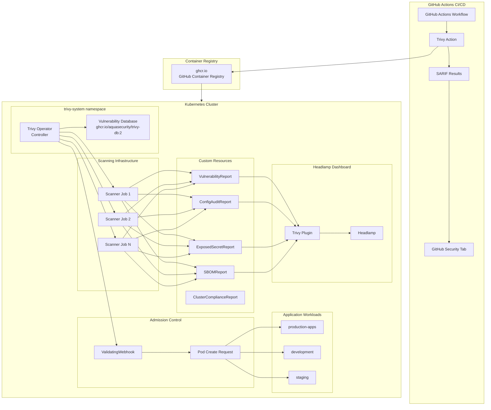
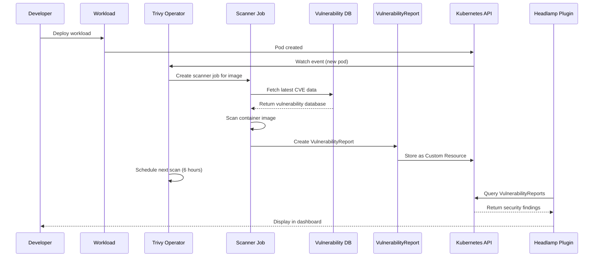
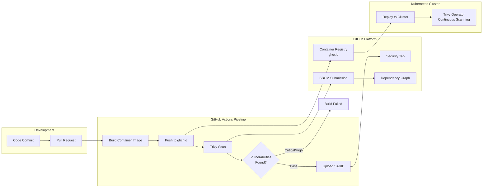

# ADR: Trivy Operator for Container Image Security Scanning

**Date:** 2026-01-22
**Status:** Proposed
**Deciders:** josimar-silva

## Context

The homelab Kubernetes cluster currently lacks a comprehensive security mechanism to prevent deployment of container images with known vulnerabilities. As containerized workloads proliferate and supply chain attacks become more sophisticated (with approximately 87% of container images containing high-severity or critical vulnerabilities in 2026), implementing automated container image scanning is critical for maintaining cluster security posture.

### Requirements

The selected solution must meet the following criteria:

1. **Cost**: Must be completely free and open-source
2. **Kubernetes Compatibility**: Must support deployment and integration with Kubernetes clusters
3. **CI/CD Integration**: Must enable scanning from GitHub Actions runners during continuous integration workflows
4. **Registry Support**: Must be capable of scanning images stored in GitHub Container Registry (ghcr.io)
5. **Admission Control**: Should provide admission controller capabilities to block vulnerable images at deployment time

### Current GitOps Architecture

The homelab cluster uses Flux CD for GitOps-based deployments with the following structure:
- Flux system namespace manages HelmRepository and HelmRelease resources
- Infrastructure components deployed via Helm charts with Flux reconciliation
- Standard pattern: namespace.yaml, repository.yaml, release.yaml per component
- Existing monitoring with Prometheus integration

## Decision

We will deploy **Trivy Operator** as the container image security scanning solution for the homelab Kubernetes cluster.

## Architecture

### Component Overview



### Scanning Flow



### CI/CD Integration



## File Structure

```text
infrastructure/base/trivy-operator/
├── kustomization.yaml          # Kustomize configuration
├── namespace.yaml              # trivy-system namespace
├── repository.yaml             # Aqua Helm repository
├── release.yaml                # HelmRelease v0.31.0
└── networkpolicies.yaml        # Security policies
```

## Key Decisions

### 1. Tool Selection: Trivy Operator

**Decision:** Deploy Trivy Operator as the container image security scanning solution instead of alternatives like Grype, Clair, or Anchore Engine.

**Rationale:**

After evaluating multiple open-source container scanning tools, Trivy Operator emerged as the best fit for the following reasons:

1. **Comprehensive Security Coverage**: Trivy provides all-in-one scanning capabilities including:
   - Container image vulnerabilities (CVE detection)
   - Infrastructure as Code (IaC) scanning (Terraform, CloudFormation, ARM templates)
   - Kubernetes manifest and configuration scanning
   - License compliance checking
   - Secret detection in images and codebases

2. **Excellent CI/CD Integration**: Official GitHub Action (`aquasecurity/trivy-action`) with native support for:
   - GitHub Container Registry authentication using `GITHUB_TOKEN`
   - SARIF format output for GitHub Security tab integration
   - Configurable severity thresholds for build failures
   - SBOM generation and submission to GitHub Dependency Graph

3. **Kubernetes-Native Architecture**: Trivy Operator provides:
   - Continuous security scanning as a Kubernetes operator
   - Custom Resource Definitions (CRDs) for security reports
   - Admission controller capabilities via ValidatingWebhook
   - Automatic scanning of existing and new workloads every 6 hours
   - Integration with Kubernetes-native tools and APIs

4. **Active Maintenance and Community**:
   - Developed and maintained by Aqua Security
   - Large community adoption and contribution
   - Regular vulnerability database updates
   - Next-Gen Trivy developments planned for 2026

5. **GitOps Compatibility**: Native support for Flux CD deployment:
   - Official Helm chart available via OCI registry and traditional Helm repository
   - Well-documented HelmRelease configurations
   - CRD management with `install.crds: CreateReplace` support

**Alternatives Considered:**

#### Grype by Anchore

**Pros:**
- Focused vulnerability scanning with excellent accuracy
- Faster incremental database updates (smaller bandwidth requirements)
- Strong SBOM integration via Syft
- Apache-licensed with corporate support from Anchore

**Cons:**
- Limited to vulnerability scanning (no IaC, secret detection, or license scanning)
- Less comprehensive Kubernetes operator capabilities
- Admission controller support not as mature as Trivy Operator
- Smaller community compared to Trivy

**Rejection Reason:** While Grype excels at focused vulnerability scanning, Trivy's all-in-one approach provides better long-term value for a homelab environment where comprehensive security coverage outweighs the benefits of specialized tooling.

#### Clair by Red Hat/Quay

**Pros:**
- Mature project with Red Hat backing
- Production-proven at scale (powers quay.io)
- Service-based architecture suitable for centralized scanning
- GPL licensed and community-maintained

**Cons:**
- More complex architecture requiring separate service deployment
- Designed primarily for registry integration rather than CI/CD workflows
- Admission controller capabilities require additional tooling
- Less straightforward GitHub Actions integration compared to Trivy
- Heavier resource requirements for service-based deployment

**Rejection Reason:** Clair's service-based architecture adds operational complexity not justified for a homelab environment. Trivy's operator pattern better aligns with Kubernetes-native workflows.

#### Anchore Engine

**Pros:**
- Comprehensive policy enforcement capabilities
- Deep SBOM analysis
- Registry federation support

**Cons:**
- More complex deployment and operation
- Higher resource requirements
- Community development shifted to Grype and Syft
- Overkill for homelab use cases

**Rejection Reason:** Complexity and resource requirements exceed homelab needs. Trivy provides equivalent functionality with simpler operations.

**Trade-offs:**

- **Database Updates**: Trivy database requires regular updates (stored in `ghcr.io/aquasecurity/trivy-db:2`), consuming network bandwidth (~200-300MB) and storage
- **False Positives**: Vulnerability databases may flag issues that are not exploitable in specific contexts, requiring manual review and policy tuning (mitigated by `ignoreUnfixed: true` configuration)
- **Resource Consumption**: Scanner jobs consume cluster resources during scan execution (~200m CPU, 512Mi memory per operator pod)

### 2. Deployment Method: Flux HelmRelease

**Decision:** Deploy Trivy Operator via Flux CD HelmRelease using the official Aqua Security Helm chart.

**Rationale:**

- **Infrastructure as Code**: All Trivy Operator configuration versioned in Git, enabling change tracking and rollback
- **GitOps Consistency**: Aligns with existing infrastructure deployment patterns (namespace.yaml, repository.yaml, release.yaml)
- **Declarative Configuration**: Kubernetes-native approach reduces operational overhead
- **Automated Reconciliation**: Flux CD detects and applies changes automatically, preventing configuration drift
- **CRD Management**: `install.crds: CreateReplace` ensures CRDs are properly installed and upgraded

**Alternatives Considered:**

- **Manual Helm Install**: Rejected due to configuration drift risk, no automatic reconciliation, manual upgrade process
- **kubectl apply manifests**: Possible but loses Helm templating benefits and complicates upgrades
- **Operator Lifecycle Manager (OLM)**: Not standardized in homelab; FluxCD already operational

**Trade-offs:**

- **FluxCD Dependency**: Trivy Operator deployment requires FluxCD operational (acceptable given FluxCD is core infrastructure)
- **Debugging Complexity**: Issues may span multiple layers (Git, FluxCD, Helm, Kubernetes operator)
- **Learning Curve**: Requires understanding FluxCD HelmRelease CRD syntax and reconciliation behavior

**Implementation:**

```yaml
# HelmRepository
apiVersion: source.toolkit.fluxcd.io/v1
kind: HelmRepository
metadata:
  name: aqua
  namespace: flux-system
spec:
  interval: 24h
  url: https://aquasecurity.github.io/helm-charts/

# HelmRelease
apiVersion: helm.toolkit.fluxcd.io/v2
kind: HelmRelease
metadata:
  name: trivy-operator
  namespace: trivy-system
spec:
  interval: 1h
  releaseName: trivy-operator
  targetNamespace: trivy-system
  chart:
    spec:
      chart: trivy-operator
      version: 0.31.0
      interval: 24h
      sourceRef:
        kind: HelmRepository
        name: aqua
        namespace: flux-system
  install:
    createNamespace: false
    crds: CreateReplace
    remediation:
      retries: 3
  upgrade:
    remediation:
      retries: 3
  values:
    trivy:
      ignoreUnfixed: true
```

### 3. Dashboard Integration: Headlamp Plugin

**Decision:** Integrate Trivy Operator with Headlamp dashboard using the trivy-headlamp-plugin for user-friendly security report visualization.

**Rationale:**

- **User-Friendly Interface**: Transforms raw CRD data into accessible dashboard views, eliminating need for kubectl or YAML expertise
- **Comprehensive Visualization**: Provides dedicated views for all Trivy security report types (vulnerabilities, config audits, exposed secrets, SBOM, compliance)
- **Existing Infrastructure**: Headlamp already deployed in homelab; plugin extends existing tool rather than adding new dashboard
- **Filtering and Drill-Down**: Interactive UI enables filtering by severity, namespace, workload type for efficient triage
- **No External Dependencies**: Plugin runs entirely within Headlamp pod, no additional services required

**Alternatives Considered:**

- **kubectl + YAML**: Functional but poor user experience, requires command-line access and CRD knowledge
- **Prometheus + Grafana**: Metrics-focused, not designed for detailed security report visualization
- **Octant with Trivy Plugin**: Alternative dashboard but would introduce new tool; Headlamp already operational
- **Standalone Trivy UI**: Not officially available; community projects less mature than headlamp plugin

**Trade-offs:**

- **Plugin Maintenance**: Requires initContainer in Headlamp deployment to download plugin on pod start
- **Version Compatibility**: Plugin requires Headlamp v0.25.0+ and Trivy Operator v0.24.1+ (both satisfied)
- **Update Process**: Plugin updates require Headlamp pod restart (acceptable for homelab use case)

**Implementation:**

#### Plugin Features
- **Vulnerability Reports**: Visual display of container image vulnerabilities with severity breakdown
- **Configuration Audits**: Kubernetes manifest security misconfigurations
- **Compliance Status**: Cluster compliance assessment results
- **Exposed Secrets**: Detection of secrets in container images
- **Infrastructure Assessment**: Node and cluster-level security findings
- **RBAC Assessment**: Role-based access control security analysis
- **SBOM Reports**: Software Bill of Materials visualization

#### In-Cluster Installation via Flux

```yaml
# Headlamp HelmRelease values
apiVersion: helm.toolkit.fluxcd.io/v2
kind: HelmRelease
metadata:
  name: headlamp
  namespace: headlamp
spec:
  interval: 1h
  chart:
    spec:
      chart: headlamp
      version: 0.25.0
      sourceRef:
        kind: HelmRepository
        name: headlamp
        namespace: flux-system
  values:
    initContainers:
      - name: trivy-plugin-download
        image: alpine:3.20
        command:
          - /bin/sh
          - -c
          - |
            wget https://github.com/kubebeam/trivy-headlamp-plugin/releases/latest/download/trivy-headlamp-plugin.tar.gz -O /tmp/trivy-headlamp-plugin.tar.gz
            mkdir -p /headlamp/plugins
            tar -xzf /tmp/trivy-headlamp-plugin.tar.gz -C /headlamp/plugins
        volumeMounts:
          - name: plugins
            mountPath: /headlamp/plugins
    volumeMounts:
      - name: plugins
        mountPath: /headlamp/plugins
    volumes:
      - name: plugins
        emptyDir: {}
    config:
      pluginsDir: /headlamp/plugins
```

#### Desktop Installation

For local development or testing:

1. Install Headlamp desktop application
2. Navigate to **Plugin Catalog** in Headlamp settings
3. Search for and install "Trivy Headlamp Plugin"
4. Restart Headlamp to activate

## Consequences

### Positive

1. **Enhanced Security Posture**: Automated vulnerability detection across all container images before and after deployment significantly reduces attack surface

2. **Supply Chain Protection**: SBOM generation and continuous monitoring help detect and track dependencies and their vulnerabilities

3. **Developer Feedback Loop**: CI/CD integration provides immediate feedback to developers about vulnerabilities during the build process, shifting security left

4. **Compliance and Visibility**: CRD-based security reports provide audit trails and visibility into cluster security state via Kubernetes API

5. **Low Resource Footprint**: Default resource requests of 200m CPU and 512Mi memory with limits of 1 CPU and 1Gi are suitable for homelab environments

6. **GitOps-Native Management**: Flux integration enables declarative configuration and automated updates via standard GitOps workflows

7. **Future-Proof**: Active development and roadmap ensure continued relevance as container security landscape evolves

8. **User-Friendly Dashboard**: Headlamp plugin provides accessible visualization of security findings without requiring kubectl expertise

9. **Multi-Layer Scanning**: Comprehensive coverage including images, IaC, Kubernetes manifests, secrets, and license compliance

10. **GitHub Security Integration**: SARIF output integrates with GitHub Security tab, consolidating security findings in developer workflow

### Negative

1. **Scan Performance Overhead**: Initial scans of all cluster workloads may take significant time; continuous 6-hour scan intervals consume cluster resources

2. **False Positives**: Vulnerability databases may flag issues that are not exploitable in specific contexts, requiring manual review and policy tuning

3. **Database Update Requirements**: Trivy database requires regular updates (stored in `ghcr.io/aquasecurity/trivy-db:2`), consuming network bandwidth and storage (~200-300MB)

4. **Admission Controller Complexity**: Misconfigured admission policies could block legitimate deployments, requiring careful policy design and testing

5. **Learning Curve**: Team must understand CVE severity levels, policy configuration, and when to override admission control for legitimate use cases

6. **CI/CD Pipeline Impact**: Build times increase due to scanning steps; teams must optimize caching and parallel execution

7. **Storage Requirements**: CRD-based reports accumulate over time and require retention policies to prevent unbounded storage growth

8. **Plugin Maintenance Overhead**: Headlamp plugin requires initContainer management and periodic updates

### Neutral

1. **Admission Controller Gradual Rollout**: Can be enabled incrementally per namespace using labels, allowing controlled adoption

2. **Policy Flexibility**: `ignoreUnfixed` and severity threshold configurations allow tuning noise vs. coverage trade-off

3. **Multi-Stage Security**: Both CI/CD scanning (pre-deployment) and operator scanning (runtime) provide defense-in-depth with some operational overlap

4. **Dashboard Access Control**: Headlamp security inherits cluster RBAC; users see only security reports for namespaces they have access to

## Implementation Details

### Deployment Process

1. **Create namespace**: `trivy-system` namespace with appropriate labels
2. **Deploy via Flux HelmRelease**: Flux CD reconciles HelmRepository and HelmRelease resources
3. **CRD Installation**: Operator installs CustomResourceDefinitions for security reports
4. **Initial Scan**: Operator discovers existing workloads and initiates vulnerability scans
5. **Monitor Scan Results**: Check CRD creation and scanner job completion
6. **Deploy Headlamp Plugin**: Add initContainer to Headlamp HelmRelease for plugin installation
7. **Configure CI/CD Pipeline**: Integrate Trivy GitHub Action into workflow files
8. **Tune Policies**: Adjust `ignoreUnfixed` and severity thresholds based on observed results
9. **Enable Admission Controller**: Gradually enable per namespace using labels

### Scanning Coverage

**Cluster Workloads (Trivy Operator):**
- All container images in running pods (every 6 hours)
- Kubernetes manifests and configurations
- ConfigMaps and Secrets for exposed credentials
- Infrastructure compliance (CIS benchmarks)

**CI/CD Pipeline (Trivy Action):**
- Container images before pushing to registry
- Infrastructure as Code files (Terraform, Kubernetes YAML)
- Application dependencies and SBOM
- GitHub Security tab integration via SARIF

### Admission Controller Configuration

Namespaces must be labeled to enable admission control:

```yaml
apiVersion: v1
kind: Namespace
metadata:
  name: production-apps
  labels:
    trivy-operator.admission: enabled
```

The admission controller validates container images against vulnerability policies and blocks deployments exceeding configured severity thresholds.

### GitHub Actions Integration

```yaml
name: Container Security Scan
on: [push, pull_request]

jobs:
  scan:
    runs-on: ubuntu-latest
    steps:
      - name: Checkout code
        uses: actions/checkout@v4

      - name: Build container image
        run: docker build -t ghcr.io/${{ github.repository }}:${{ github.sha }} .

      - name: Run Trivy vulnerability scanner
        uses: aquasecurity/trivy-action@0.33.1
        with:
          image-ref: 'ghcr.io/${{ github.repository }}:${{ github.sha }}'
          format: 'sarif'
          output: 'trivy-results.sarif'
          severity: 'CRITICAL,HIGH'
          exit-code: '1'  # Fail build on vulnerabilities

      - name: Upload Trivy results to GitHub Security tab
        uses: github/codeql-action/upload-sarif@v3
        if: always()
        with:
          sarif_file: 'trivy-results.sarif'

      - name: Generate and submit SBOM
        uses: aquasecurity/trivy-action@0.33.1
        with:
          image-ref: 'ghcr.io/${{ github.repository }}:${{ github.sha }}'
          format: 'github'
          output: 'dependency-results.sbom.json'
```

### Policy Configuration Recommendations

- **Start Conservative**: Use `ignoreUnfixed: true` to reduce noise from vulnerabilities without available patches
- **Severity Thresholds**: Begin with `CRITICAL,HIGH` for admission controller to avoid blocking all deployments
- **Namespace-Based Policies**: Implement different policies for development vs. production environments
- **Exception Process**: Document workflow for accepting vulnerability risk and creating policy exceptions
- **Regular Reviews**: Schedule quarterly reviews of policy effectiveness and false positive rates

### Monitoring and Alerts

- **Prometheus Integration**: Trivy Operator exposes metrics for monitoring scan success rates and vulnerability trends
- **Scanner Job Monitoring**: Track scanner job completion and failure rates
- **Admission Webhook Latency**: Monitor webhook response times to detect performance issues
- **Critical Vulnerability Alerts**: Configure alerts for critical vulnerabilities detected in running workloads
- **Dashboard Creation**: Create Grafana dashboards for security posture visualization

### Resource Planning

**Trivy Operator:**
- CPU Request: 200m
- Memory Request: 512Mi
- CPU Limit: 1 CPU
- Memory Limit: 1Gi

**Vulnerability Database Storage:**
- Approximately 200-300MB for database image

**CRD Storage:**
- Plan for retention policies to limit historical report accumulation
- Estimate ~1MB per VulnerabilityReport CRD
- With 100 workloads and 30-day retention: ~3GB maximum

**Scanner Jobs:**
- Ephemeral jobs created per scan (cleaned up after completion)
- Resource consumption scales with number of workloads

### Upgrade Strategy

1. **Monitor Release Notes**: Review Trivy Operator changelog for breaking changes
2. **Test in Non-Production**: Validate new version in development namespace first
3. **Update HelmRelease**: Modify chart version in Git repository
4. **Flux Reconciliation**: Flux CD automatically applies update within reconciliation interval
5. **Validate CRDs**: Ensure CRDs upgraded successfully (FluxCD handles via `CreateReplace`)
6. **Check Scanner Jobs**: Verify scanner jobs complete successfully with new version
7. **Monitor Admission Controller**: Ensure webhook continues functioning without blocking legitimate deployments
8. **Rollback if Needed**: Git revert triggers automatic rollback via Flux CD

### Disaster Recovery

**Backup Requirements:**
- **CRDs**: Automatically recreated by operator; no backup needed (reports are ephemeral)
- **Configuration**: HelmRelease in Git serves as source of truth
- **Database**: Vulnerability database automatically fetched from `ghcr.io/aquasecurity/trivy-db:2`

**Recovery Process:**
1. Flux CD redeploys HelmRelease from Git
2. Operator recreates CRDs
3. Initial scan runs automatically for all workloads
4. Admission controller webhook reregistered

**Recovery Time Objective (RTO):** ~5 minutes (operator restart time)

**Recovery Point Objective (RPO):** 6 hours (maximum time since last scan)

### Rollout Strategy

1. **Phase 1 - Operator Deployment**: Deploy Trivy Operator to `trivy-system` namespace via Flux HelmRelease
2. **Phase 2 - Monitoring**: Monitor operator logs and initial scan results for existing workloads
3. **Phase 3 - Policy Tuning**: Adjust policies based on observed vulnerability patterns and false positive rate
4. **Phase 4 - Non-Critical Namespace Testing**: Enable admission controller on development/staging namespaces for testing
5. **Phase 5 - CI/CD Integration**: Integrate Trivy scanning into GitHub Actions pipelines with non-blocking mode initially
6. **Phase 6 - Dashboard Deployment**: Install Headlamp plugin for security report visualization
7. **Phase 7 - Production Enforcement**: After validation period, enforce admission control on production namespaces and enable build failures for critical vulnerabilities

## References

- [Trivy Official Documentation](https://trivy.dev/)
- [Trivy Operator GitHub Repository](https://github.com/aquasecurity/trivy-operator)
- [Trivy GitHub Action](https://github.com/aquasecurity/trivy-action)
- [Trivy GitOps Integration Guide](https://trivy.dev/v0.67/tutorials/kubernetes/gitops/)
- [Flux HelmRelease Documentation](https://fluxcd.io/docs/components/helm/)
- [Trivy Headlamp Plugin](https://github.com/kubebeam/trivy-headlamp-plugin)
- [Headlamp Kubernetes Dashboard](https://headlamp.dev/)
- [Container Security Best Practices](https://kubernetes.io/docs/concepts/security/pod-security-standards/)
- [SARIF Format Specification](https://docs.oasis-open.org/sarif/sarif/v2.1.0/sarif-v2.1.0.html)
- [GitHub Security Features Documentation](https://docs.github.com/en/code-security)
